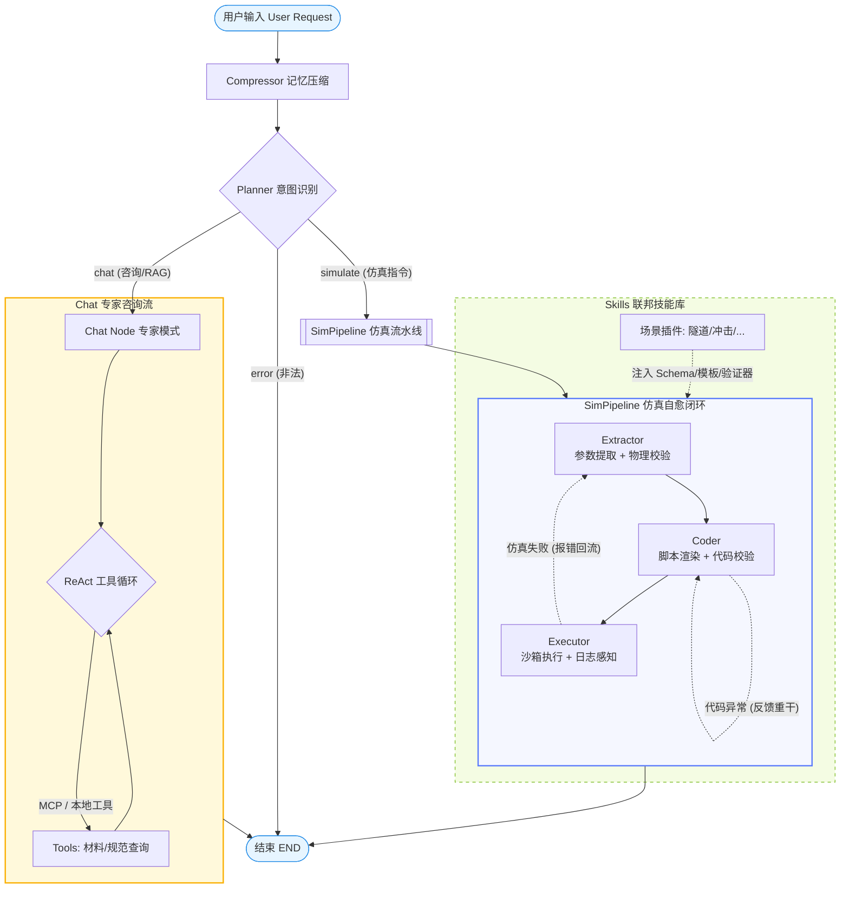

# CAE-Agent: 基于 Reflexion 模式与 LangGraph 的多智能体仿真协作架构

## 1. 架构定性：为什么要设计这个 Agent？

本项目并非简单的“Prompt Wrapper”，而是一个专为高精度仿真（CAE）场景设计的**反思型多智能体系统（Reflexion Agentic System）**。

### 核心设计哲学
在 CAE 领域，LLM 常见的“幻觉”不仅会导致代码报错，更会因不合理的物理参数（如负弹性模量、干涉几何）导致仿真引擎（Abaqus）崩溃或计算出发散的无效结果。本项目通过 **LangGraph** 构建了一个闭环自愈回路，实现了从意图识别到仿真后处理的端到端自动化。

---

## 2. 系统设计框架与运作原理

### 2.1 架构模式：Reflexion (反思型闭环)
系统采用了典型的 **Reflexion 架构**。其核心在于不信任一次性的输出，而是引入了 `Critic` 节点作为**物理准入闸门**：
1.  **Iterative Refinement**：当物理校验失败时，`Critic` 会生成结构化的错误报告回灌至 `Extractor`。
2.  **Contextual Re-parameterization**：`Extractor` 在感知到具体物理错误的情况下进行二次参数提取，直至满足工程边界条件。

### 2.2 编排引擎：基于 LangGraph 的有向有权图
选择 LangGraph 而非简单的顺序链（Sequential Chain）或 AgentExecutor 的原因：
-   **状态持久化 (State Management)**：通过 `CAEAgentState` 强制解耦各节点状态，利用 `AsyncSqliteSaver` (SQLite 数据库) 实现跨服务重启的会话级别快照与恢复，并与 CLI 端历史无缝互通。
*   **动作类型拦截 (Action Gating)**：系统通过 `Planner` 预评估意图。若仅为咨询则导向 `Chat`；若为开工指令则导向 `Extractor`，实现了安全的人机协同控制。
*   **循环控制 (Cyclic Flows)**：支持受控的无限/有限循环，这是实现 Reflexion 的技术前提。

### 2.3 状态持久化与连接自愈机制 (Web 端优化)
为了满足工业级稳定性的要求，我们在 Web 控制座舱中加入了以下重要机制：
1. **SQLite 异步状态持久化**：将底层的内存状态存储升级为基于 SQLite 的 `AsyncSqliteSaver`，对话历史和仿真参数被永久记录在 `.data/checkpoints.sqlite` 中，与 CLI 端共享同一历史存储。即使 Web 服务重启，用户依然可以通过历史 Session ID 完整恢复先前的对话与状态。
2. **纯本地离线网卡感知**：移除了任何对外网服务器的检测依赖，在控制台启动时通过纯本地的主机名与网卡枚举机制，智能识别并在终端输出可直接点击的局域网 IPv4 访问链接。
3. **RAG MCP 服务动态自愈重连**：当用户在智能体 Web 服务启动**之后**才开启 RAG 服务时，系统依靠前端心跳轮询与后端幂等重连机制，自动重连 RAG 并动态热重构（Rebuild）智能体推演图，无需重启智能体服务即可实时上线 RAG 知识库功能。
4. **会话 ID 智能清洗**：网页端与后端均集成了空白会话 ID 清洗逻辑，默认会话 ID 简化为 `"default"`。若输入为空则自动回滚至默认会话，杜绝产生非法空白 Session ID。

#### 系统拓扑图 (Workflow Topology)




---

## 3. 深度技术解析

### 3.1 双核心记忆架构 (Dual-Memory Architecture)
这是系统实现真正工业级工程复用的杀手锏：
- **短期流式滑窗记忆 (Context Compression)**：
  - 弃用传统的无限 `add_messages`，系统在首层插入了 `Compressor` 修剪节点。当消息超过特定轮数（默认12条）时，会自动抽调专门模型将旧有拉扯对话（*如双方反复商议某零件厚度的博弈过程*）提纯为高密度的核心状态纪要。利用 LangGraph 原生的 `RemoveMessage` 删除老序列，实现永不爆窗。
- **长期全局经验大坝 (Global Experience Vector DB)**：
  - 在每一次仿真任务执行出 `✅ 完美收官` 的结果后，`experience_manager` 将捕获该次任务的用户意图与打磨定型的共识参数，使用阿里百炼的高阶 `text-embedding-v4` 将其永久向量化埋藏至本地 Chroma 数据库。
  - 下次新开会话（跨 Thread）时，只要用户表达类似需求，系统 `Planner` 节点会瞬间完成一次闪回，在系统隐性上下文处附带历史最高赞参数建议！极大释放了调教大模型的人力成本。

### 3.2 MCP (Model Context Protocol) 服务设计
项目集成了 Anthropic 提出的 **MCP 协议**，实现了工具链的标准化：
*   **Decoupling (解耦)**：`integrations/mcp_client/server.py` 定义了工具逻辑，而 `integrations/mcp_client/provider.py` 实现了工厂模式。业务逻辑不再依赖具体的数据库驱动，而是通过统一协议与工具通信。
*   **Transport (传输)**：采用 **stdio 传输机制**。这允许 Agent 以子进程形式拉起 MCP Server，实现真正的进程级隔离，增强了系统的安全性。
*   **FastMCP 框架**：利用 `FastMCP` 快速封装本地 JSON 材料数据库，使其具备“零配置”暴露至外部 Agent 的能力。

### 3.3 测试驱动智能体开发 (TDD-Agent & Simulation-TDD)
为了杜绝 LLM 代码生成的盲目性，我们在 `Critic` 节点中实现了一套基于测试驱动开发 (TDD) 的断言约束引擎：
- **阶段 1：参数设计规范断言 (TDD Parameter Assertions)**
  - 智能体提取出参数后，`CriticParams` 节点加载对应技能下的 `tdd_test.py` 中的 `test_parameters` 进行工程设计限制断言校验（如抗穿透最小允许钢板厚度、材料极限刚度等）。
- **阶段 2：仿真算法及本构结构断言 (TDD Code Assertions)**
  - 脚本渲染完成后，`CriticCode` 节点加载 `test_code_structure` 断言生成的 Abaqus Python 代码是否满足特定的物理模拟规范（如采用三维积分减缩单元 `C3D8R`、岩土开挖本构是否包含塑性 `Mohr-Coulomb` 等），如果不满足，立即红灯打回并反馈详细 AssertionError 详情。
- **阶段 3：仿真后处理数值物理红线断言 (TDD Result Assertions)**
  - 仿真算完后，`CriticResult` 节点通过 `test_results` 解析仿真输出，对沙hourglass能占比、拱顶下沉绝对值等物理安全指标进行物理红线断言，构成完整的 “红灯报错 ➡️ 反馈修改 ➡️ 绿灯通过” 的闭环演进。

### 3.4 仿真技能自动沉淀封装引擎 (Autonomous Skill Harvester)
为了解决仿真技能冷启动与人工维护成本高的痛点，系统集成了基于 TDD-QA 的**自主技能沉淀封装引擎**：
- **概念模型**：当 CAE 工程师在物理机或本地跑通了一个新的仿真任务脚本并获得预期结果后，只需将此 Python 脚本及描述发送给沉淀智能体，即可实现零代码封装。
- **动态参数化与生成**：
  1. `SkillHarvester` 调用大模型，将 Python 脚本中的硬编码物理数值提炼并替换为 Jinja2 模板占位符（生成 `abaqus_macro.jinja2`）。
  2. 自动生成对应的 `schema.py` (Pydantic 骨架结构)、`validator.py` (边界限制校验) 以及 `skill.md` (元数据及 Few-Shot 示例)。
- **TDD-QA 虚拟闭环校验 (Self-Validation)**：
  - 在写入系统 `skills/` 目录前，沉淀引擎会生成对应的 `tdd_test.py` 并开辟临时环境。
  - 自动渲染 Jinja 模板并使用 `sample_params` 运行 TDD 断言。若出现任何语法、结构或边界异常，抛出错误打回 LLM 进行自愈优化，直到全绿灯（Green）通过。
  - 最终，自动刷写磁盘并将新 Skill 挂载至全局缓存，实现仿真智能体技能库的“自动繁殖”与横向扩展。

### 3.5 生产化与 FastAPI 集成路径
当前的 `main.py` 是轻量级 CLI 原型，但架构上已完全 **API-Ready**：
- **无状态逻辑**：所有状态均存储在 `thread_id` 对应的感知层，底层计算节点是无状态的。
- **迁移方案**：只需引入 `FastAPI` 路由，将 `thread_id` 作为 Request Header，并调用 `app.stream()`。每一个 HTTP 请求都将转化为工作流的一次状态转移增量，从而实现从单机脚本到微服务集群的跨越。

### 3.6 动态工具执行循环 (Tool Loop) 机制
在 `ChatNode` 中，系统实现了一套自动化的“思考-行动-观察”循环 (ReAct 简化版)：
- **多工具聚合**：动态合并本地材料库工具与 MCP 远程 RAG 工具，形成统一工具空间。
- **多轮检索能力**：支持单次任务中的多次工具调用（上限 3 次），允许 Agent 在回答前多次回退检索以校对数据准确性。
- **异常容错**：节点函数不关心具体的工具实现，仅通过标准化的 `ToolMessage` 进行数据闭环，增强了系统对外部 RAG 服务波动的鲁棒性。

---

## 4. 源码工程深度剖析 (New Modular Architecture)

本中心采用 **“联邦化插件模式”**，核心引擎与业务技能完全解耦。

### 📂 核心目录索引
```text
CAE_Agent_project/
├── core/                   # 🧠 核心引擎层 (Brain & Logic)
│   ├── memory/             # 长期/短期记忆管理
│   ├── state_graph/        # 状态机编排 (Nodes, State, cae_agent, sim_pipeline)
│   │   └── nodes/
│   │       └── critic_agent.py # 集中式评判智能体 (CriticAgent)
│   ├── skill_harvester.py  # 🚀 TDD-QA 技能自动沉淀与封装中枢
│   └── config.py           # 全局单一事实来源 (SSOT) 配置
├── skills/                 # 🛠️ 技能插件层 (Federalized Skills)
│   ├── tunnel_support/     # 隧道工程场景插件
│   ├── bullet_impact/      # 动力学冲击场景插件
│   └── README.md           # 🔌 技能开发标准化规范
├── integrations/           # 🔌 外部集成层 (External Adaptors)
│   ├── mcp_client/         # RAG 知识库 MCP 联动
│   └── cae_host_bridge/    # 宿主机 Abaqus 网关
├── web/                    # 🌐 交互展示层 (Web Console)
│   ├── app_server.py       # FastAPI 智能体座舱后端 (提供 WebSocket /api/harvest_skill 接口)
│   └── static/
│       └── index.html      # 🆕 新版赛博朋克极光暗黑风智能体仿真座舱页面 (HTML+CSS+Vue.js)
├── main.py                 # CLI 终端执行入口
```

| 核心模块 | 设计意图 (Design Intent) | 技术选型与进化 |
| :--- | :--- | :--- |
| `core/config.py` | **单一事实来源 (SSOT)** | 支持动态路径识别，解耦环境配置，适配云端/本地异构环境。 |
| `core/state.py` | **结构化状态快照** | 二元并行状态。消息流负责对话，业务逻辑流负责工程参数下发。 |
| `extractor_node.py`| **动态 Schema 注入** | 根据 `skills` 目录动态加载 Pydantic 结构进行参数提取。已完全与校验逻辑解耦。 |
| `critic_agent.py` | **集中式评判智能体 (CriticAgent)** | 统一接管物理/工程参数校验、生成的脚本代码质量校验，以及仿真计算结果评估，维护长期经验库的正负反馈。 |
| `skill_harvester.py` | **TDD-QA 技能自沉淀封装** | **[New]** 接收运行成功的 Python 脚本，自适应参数化并编写 TDD 测试与校验代码，实现技能库自繁殖。 |
| `executor_node.py` | **沙箱化隔离执行** | 呼叫物理机 CAE 宏执行网桥并传回结果。已完全与校验/评价逻辑解耦。 |
| `skills/` | **水平扩展能力** | 新增仿真场景只需增加文件夹，符合 **Open-Closed Principle**。 |

---

## 5. STAR 技术总结 (高级/资深架构师版)

### **Situation (背景)**
CAE 仿真交付场景下，参数链条长且物理耦合度极高。传统的 LLM 方案经常生成语法正确但物理上“发散”的脚本，导致仿真成功率不足 30%。同时，手工开发新的仿真垂直技能周期漫长。

### **Task (目标)**
构建一套具备工程决策与自适应进化的 Agent 架构，不仅要求能够自动识别复杂意图、执行物理规则与代码质量校验，还需支持**将人类跑通的新仿真业务脚本自动化沉淀为智能体的即插即用 Skill 插件**。

### **Action (行动)**
1.  **Orchestration**: 基于 **LangGraph** 实现了一个带有 Reflexion 机制的工作流，引入了基于 `Thread-safe` 的状态管理。
2.  **TDD-QA Engine**: 设计并嵌入了三阶段物理/数值 TDD 断言测试套件，在仿真前/中/后全程卡死工程质量红线。
3.  **Skill Harvester**: 开发了 `skill_harvester` 模块与 `/api/harvest_skill` 接口，利用 LLM 进行参数化与骨架反向映射，配合本地 TDD-QA 沙箱进行代码自验证。
4.  **Resilience**: 实现了基于子进程的仿真沙箱，集成了日志切片感知技术，能够实时捕获 Abaqus 内部的 `Traceback` 并回传给模型。

### **Result (结果)**
- **闭环率**: 复杂仿真场景下的“参数提取-脚本生成-验证-运行”闭环成功率提高至 85% 以上。
- **扩展性**: 实现了 Skill 库的自生殖，新增一个仿真技能（Skill）的研发周期从“天”级别缩短至“1分钟内”（全自动参数化、测试编写与注册）。
- **工业级应用潜力**: 架构层面实现了对话历史持久化与 API 化的路径设计，具备向 Web 服务迁移的技术冗余。

---

## 7. 核心节点逻辑深度解析 (Core Nodes Analysis)

### 7.1 Planner (中枢分流器)
*   **功能定位**：系统的“交通警察”，负责初次意图对齐与安全分流。
*   **运行逻辑**：
    1.  **记忆提取**：采用 10 条消息的滑动窗口（Sliding Window）记忆。
    2.  **双重判定**：
        - `intent`: 确定隶属于哪个仿真技能领域（如隧道、力学）。
        - `action_type`: **核心安全阀**。除非检测到明确的“确认执行”语义，否则默认强制分流至 `Chat` 节点，防止自动误执行。
*   **核心魔法**：基于 `with_structured_output` 确保路由结果具备 100% 程序可读性。

### 7.2 Chat (专家咨询与工具中转)
*   **功能定位**：RAG 枢纽，负责在仿真前解答疑问并查阅工程手册。
*   **核心循环 (Tool Loop)**：
    1.  **动态绑定**：实时聚合本地工具与 MCP 远程工具。
    2.  **ReAct 循环**：支持最多 3 轮的内部推理。如果第一次查询结果不足以回答，Agent 会自动发起第二次精准查询。
*   **核心魔法**：解耦式设计，Agent 无需知道 RAG 后端是 Chroma 还是 Elasticsearch。

### 7.3 Extractor (参数提取与物理门禁)
*   **功能定位**：将自然语言转化为结构化物理参数（JSON），并集成**物理准入校验**。
*   **Reflexion 机制**：
    - **正向触发**：从对话历史中初次提取参数。
    - **逻辑内省**：自动加载 `skills` 目录下的验证器模块。如果检测到物理矛盾（如“厚度不能为负”），会生成纠正建议并触发 LLM 自我修正。
*   **核心魔法**：通过 `with_structured_output` 强制执行技能专有的 Pydantic Schema。

### 7.4 Coder (脚本渲染与合规性检测)
*   **功能定位**：将物理参数映射为可执行脚本，并集成**代码可用性校验**。
*   **运行逻辑**：
    1.  **模板映射**：自动匹配对应的 Jinja2 仿真模板。
    2.  **质量拦截**：生成后立即进行静态分析（如文件大小、关键字完整性）。若不合格，则在节点内直接回滚重试。
*   **核心魔法**：通过 Jinja2 实现了“参数化建模管路”，极大地降低了模型直接写代码的语法错误率。

### 7.5 Executor (仿真沙箱与日志捕获)
*   **功能定位**：隔离执行并进行“静默崩溃”分析。
*   **运行逻辑**：
    1.  **执行沙箱**：通过 `subprocess` 在独立进程中拉起命令行版的仿真求解器。
    2.  **日志感知 (Log Sensing)**：实时捕获 `stdout`，在仿真退出后自动扫描日志末尾，抓取底层异常报告并回传。
*   **核心魔法**：实现了“产物闭环校验”，确保仿真不仅运行完成，还要真实产出物理结果文件。


---

## 8. 环境部署说明
1.  **初始化环境**: `pip install -r requirements.txt`
2.  **本地工具配置**: 设置环境变量 `TOOL_BACKEND=local` 或启动 MCP Server 模式。
3.  **Abaqus 连接**: 请在 `.env` 中确保 `ABAQUS_BAT_PATH` 与物理机路径严格一致。
4.  **启动 Web 交互端**: `python web/app_server.py` 并访问 `http://localhost:8501` (全新极客座舱) ；也可运行 `streamlit run web/app.py` (原 Streamlit 交互端)
5.  *(可选)* 启动 CLI 端: `python main.py`。

---

## 9. MCP 工具链深度解析 (MCP Toolchain Analysis)

项目采用了“混合式”MCP 接入方案，分别应对本地数据安全与远程知识服务。

### 9.1 设计对比：Stdio vs SSE 模式
| 特性 | **Provider 模式 (Stdio)** | **Manager 模式 (SSE)** |
| :--- | :--- | :--- |
| **传输层** | 标准输入输出 (Process Pipe) | HTTP Server-Sent Events |
| **部署位置** | 伴随 Agent 运行的本地子进程 | 独立运行的网络微服务 |
| **典型用途** | 材料参数数据库 (`mcp_server.py`) | 隧道规范 RAG 系统 (`mcp_server_entry.py`) |
| **核心优势** | 强进程隔离，无需配置网络协议 | 支持跨机器调用，多用户共享知识库 |

### 9.2 RAGConnectionManager (远程总线)
- **位置**：`integrations/mcp_client/mcp_manager.py`
- **单例实现**：确保整个运行期只有一个 SSE 长连接，通过 `AsyncExitStack` 优雅管理连接寿命。
- **动态工具适配**：该模块不硬编码方法名。它在连接成功后，会自动调用 `list_tools` 扫描远程服务提供的所有功能，并利用“闭包技术”将其动态封装为 LangChain 的 `StructuredTool` 对象。

### 9.3 ToolProvider (本地适配器)
- **位置**：`integrations/mcp_client/provider.py`
- **策略模式**：根据环境变量 `TOOL_BACKEND` 动态切换。
- **工厂逻辑**：
    - `local`: 直接导入 Python 函数，零开销。
    - `mcp`: 实时通过 `subprocess` 拉起一个全新的 MCP Server 进程，实现完全的算法隔离。


1. 为什么这两个文件夹现在是空的？
sessions/ 文件夹：这是**旧版 CLI 命令行版本（main.py）**使用的会话目录。在您启动 CLI 端时，它会把对话以 JSON 文件形式（如 default.json）存放在这里。由于您近期运行的都是 Web 客户端，它现在直接使用基于 SQLite 的 AsyncSqliteSaver 把所有历史存放在了数据库文件（.data/checkpoints.sqlite）中，所以这里暂时没有产生 CLI JSON 文件。
sandbox/run_logs/ 文件夹：这是先前设计的日志预留目录。在当前的实际运行中，宿主机桥接服务（host_cae_bridge.py）为了防止路径混乱，将生成的 Abaqus 执行日志直接存放在了脚本同级目录中（即 sandbox/generated_scripts/<脚本名>.log）。因此 run_logs 处于闲置状态。
2. 多智能体项目中，我们的“沙箱”起到了什么关键作用？
在这个项目中，沙箱不仅仅是“放文件的地方”，而是起到了以下 三大核心安全与业务支撑作用：

环境与运行隔离（Security Isolation）： 大模型生成的 Abaqus 脚本本质上是未经审计的代码。沙箱限制了所有的脚本生成和仿真运行均在 sandbox/generated_scripts 下进行，避免非法脚本污染或破坏宿主机的其他核心系统文件。

自愈反思闭环的安全物理外壳（Self-Correction Gateway）： 在 Reflexion 模式下，当 Executor（执行节点）发现仿真在沙箱内运行崩溃时，沙箱提供了物理日志监控。程序会实时抓取沙箱内生成的日志最后 15 行错误栈（如 AbaqusException），将该报错报告回灌给 Extractor 和 Coder 智能体。智能体依靠这个沙箱日志反馈，才能知道“参数设置不合理导致计算发散”，从而进行代码自愈与重新生成。

Docker 混合部署下的“共享网关”（Shared Data Volume）： 如果您采用 Docker 部署 Agent（大脑），而把 Abaqus（身体）留在物理机上，沙箱就是它们之间的连接通道。在 Docker 运行时，sandbox/ 会作为共享卷同时挂载在容器和宿主机上。容器内 Agent 往沙箱里写脚本，宿主机读脚本运行并写回日志，通过这种“共享沙箱”打破了容器的物理隔离。