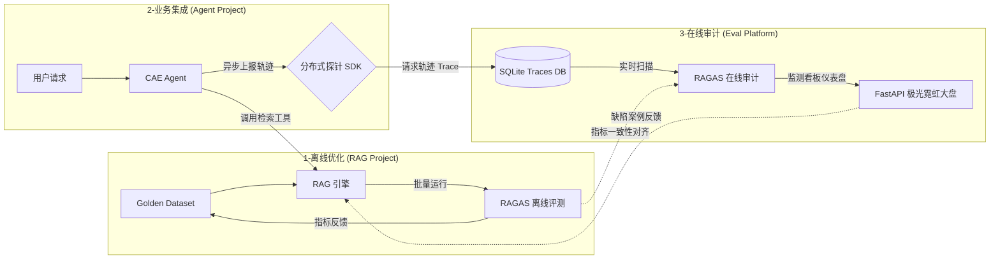
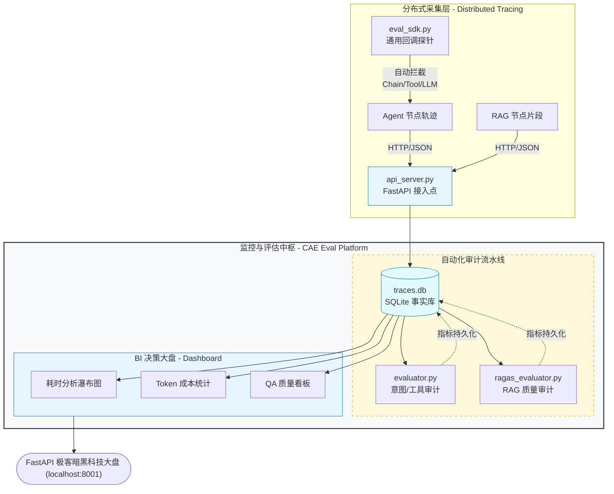
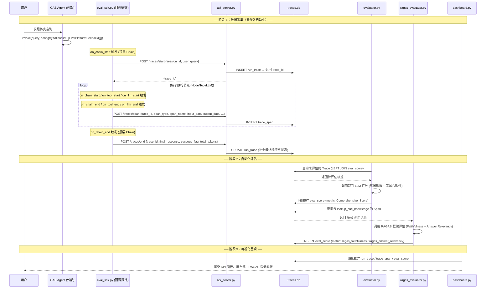
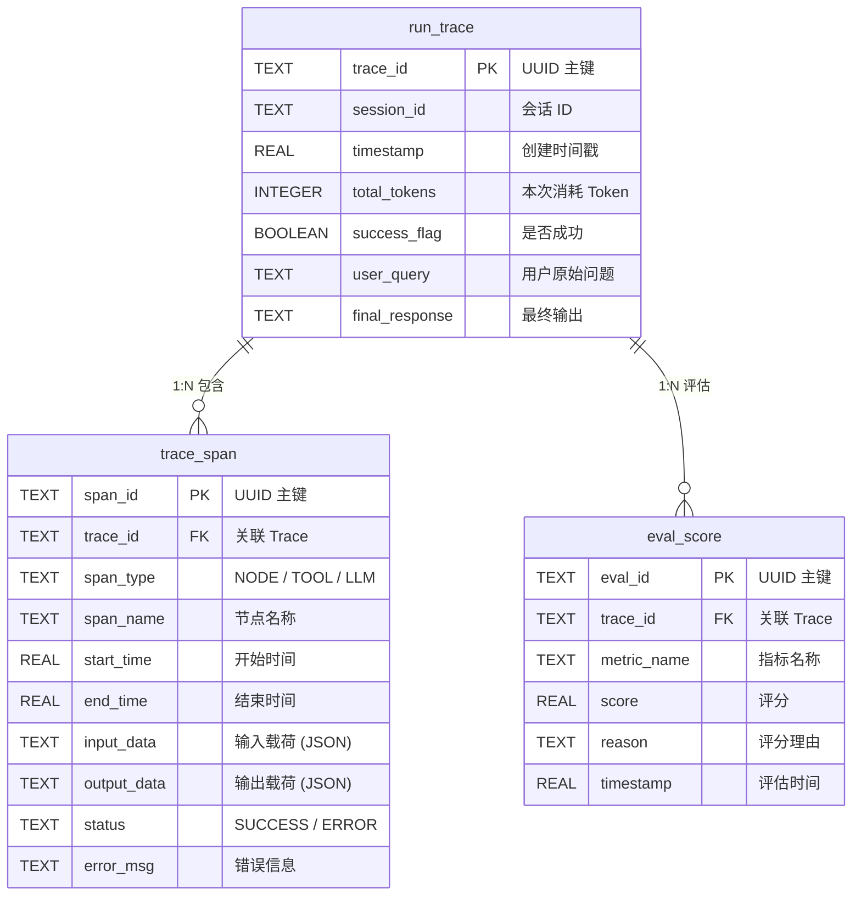
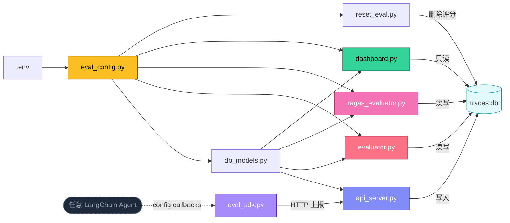

# CAE-Observability & RAGOps 质量治理中枢

本项目是一个面向 CAE 仿真智能体（Agent）的 **工业级可观测性与 RAG 自动化评估平台**。通过建立"研发优化、业务集成、在线审计"的三位一体闭环，解决了 RAG 系统在生产环境下质量难量化、幻觉难监控、成本难核算的痛点。

---

## 📁 项目文件总览

```
CAE_Eval_Platform/
├── .env                  # 环境变量配置（API Key、模型型号）
├── eval_config.py        # 全局配置中心（读取 .env，统一管理路径与模型）
├── db_models.py          # 数据库模型层（表结构定义 + 探针 SDK）
├── api_server.py         # FastAPI 采集服务 + 静态资源服务器 (运行在 8001 端口)
├── static/
│   └── index.html        # 🆕 新版极客霓虹暗黑科技大盘页面 (HTML+CSS+Vue.js+Chart.js)
├── eval_sdk.py           # 🆕 通用零侵入回调探针（LangChain Callback，即插即用）
├── evaluator.py          # LLM-as-a-Judge 意图/工具评估引擎
├── ragas_evaluator.py    # RAGAS 框架 RAG 质量评估引擎
├── dashboard.py          # Streamlit 可视化监控大盘 (旧版/备用)
├── reset_eval.py         # 评估数据重置工具
├── requirements.txt      # Python 依赖清单
├── traces.db             # SQLite 运行时数据库（自动生成）
└── README.md             # 项目技术报告文档
```

---

## 🏗️ 三位一体系统架构

该体系由三个深度协同的项目组成，实现了从算法研发到在线监控的完整工程治理闭环。



---

## 🗺️ 平台内部运行拓扑



---

## 🔄 完整数据流转过程

下面以一次完整的 Agent 对话为例， 展示数据在各模块间的流转时序：



---

## 📄 各文件详细解析

### 1. `eval_config.py` — 全局配置中心

| 属性 | 说明 |
|:---|:---|
| **职责** | 集中管理平台所有可配置项，实现配置与代码分离 |
| **行数** | 17 行 |
| **依赖** | `python-dotenv` |

**核心逻辑：**

- 通过 `load_dotenv()` 加载 `.env` 文件中的环境变量
- 暴露 3 个全局常量供其他模块引用：
  - `EVAL_JUDGE_MODEL`：裁判模型型号（默认 `qwen-max`），用于 `evaluator.py` 和 `ragas_evaluator.py`
  - `EVAL_EMBEDDING_MODEL`：Embedding 模型型号（默认 `text-embedding-v4`），用于 RAGAS 评估
  - `DB_PATH`：SQLite 数据库路径（默认当前目录下 `traces.db`）

**被引用方：** `db_models.py`、`evaluator.py`、`ragas_evaluator.py`、`dashboard.py`、`reset_eval.py`

---

### 2. `db_models.py` — 数据库模型层 & 探针 SDK

| 属性 | 说明 |
|:---|:---|
| **职责** | ① 定义并初始化 SQLite 三表结构；② 提供 `TraceLogger` 探针 SDK 类 |
| **行数** | 108 行 |
| **依赖** | `sqlite3`、`eval_config` |

**核心内容：**

#### `init_db()` 函数 — 数据库初始化
创建 3 张核心数据表（若不存在）：

| 表名 | 用途 | 核心字段 |
|:---|:---|:---|
| `run_trace` | 记录一次完整的用户请求生命周期 | `trace_id`(PK), `session_id`, `timestamp`, `total_tokens`, `success_flag`, `user_query`, `final_response` |
| `trace_span` | 记录 Trace 下每一跳执行详情 | `span_id`(PK), `trace_id`(FK), `span_type`(NODE/TOOL/LLM), `span_name`, `start_time`, `end_time`, `input_data`(JSON), `output_data`(JSON), `status`, `error_msg` |
| `eval_score` | 存放自动化评分结果 | `eval_id`(PK), `trace_id`(FK), `metric_name`, `score`, `reason`, `timestamp` |

#### `TraceLogger` 类 — 探针 SDK
供 Agent 端或 `api_server.py` 调用的轻量 SDK，提供 3 个方法：

| 方法 | 功能 | 对应 API |
|:---|:---|:---|
| `start_trace(session_id, user_query)` | 创建一条新的追踪记录，返回 `trace_id` | `POST /traces/start` |
| `log_span(trace_id, span_type, ...)` | 记录一个执行节点（序列化 input/output 为 JSON） | `POST /traces/span` |
| `end_trace(trace_id, final_response, ...)` | 补全 Trace 的最终响应、状态和 Token 消耗 | `POST /traces/end` |

---

### 3. `api_server.py` — FastAPI 数据采集服务

| 属性 | 说明 |
|:---|:---|
| **职责** | 作为 HTTP 接入点，接收分布式 Agent 上报的链路追踪数据 |
| **行数** | 83 行 |
| **监听端口** | `0.0.0.0:8001` |
| **依赖** | `FastAPI`、`Pydantic`、`db_models` |

**核心逻辑：**

- 启动时通过 `@app.on_event("startup")` 自动调用 `db_models.init_db()` 确保数据库就绪
- 实例化 `TraceLogger` 作为底层数据操作层
- 通过 3 个 Pydantic 模型实现严格的请求体校验：

| 端点 | 请求体模型 | 功能 |
|:---|:---|:---|
| `POST /traces/start` | `TraceStartRequest(session_id, user_query)` | 开始一次新的追踪，返回 `trace_id` |
| `POST /traces/span` | `SpanLogRequest(trace_id, span_type, span_name, start_time, end_time, input_data, output_data, status, error_msg)` | 记录一个执行节点的详细信息 |
| `POST /traces/end` | `TraceEndRequest(trace_id, final_response, success_flag, total_tokens)` | 结束追踪，写入最终响应与汇总指标 |

- 所有端点统一使用 `try/except` 包裹，异常时返回 HTTP 500

---

### 4. `evaluator.py` — LLM-as-a-Judge 意图评估引擎

| 属性 | 说明 |
|:---|:---|
| **职责** | 使用裁判 LLM 对 Agent 运行轨迹进行综合评分（意图理解 + 工具合理性） |
| **行数** | 110 行 |
| **评估维度** | 意图理解与沟通 (0-10分)、工具调用合理性 (0-10分) |
| **依赖** | `langchain-openai`、`eval_config`、`db_models` |

**核心逻辑：**

`run_evaluation()` 函数执行流程：

1. **抓取待评估样本**：通过 `LEFT JOIN` 查询 `run_trace` 中尚未出现在 `eval_score` 中的记录
2. **初始化裁判 LLM**：使用 `ChatOpenAI` 连接阿里云 DashScope API，加载 `eval_config.EVAL_JUDGE_MODEL`
3. **构建评估 Prompt**：
   - System Prompt 定义了严苛的 AI 裁判角色及评价维度
   - 使用 `with_structured_output(schema)` 约束 LLM 返回 `{score, reason}` JSON 结构
4. **逐条评估**：
   - 从 `trace_span` 提取完整执行轨迹（节点名 + 输出内容）
   - 拼接 User Query → 各节点轨迹 → Final Response 作为评估上下文
   - 调用结构化 LLM 获取评分
5. **结果入库**：将评分以 `metric_name = "Comprehensive_Score"` 写入 `eval_score` 表

---

### 5. `ragas_evaluator.py` — RAGAS RAG 质量评估引擎

| 属性 | 说明 |
|:---|:---|
| **职责** | 基于 RAGAS 框架对 RAG 检索质量进行自动化评估（无需标准答案） |
| **行数** | 126 行 |
| **评估指标** | Faithfulness（忠实度）、Answer Relevancy（回答相关度） |
| **依赖** | `ragas`、`datasets`、`langchain-community`、`eval_config`、`db_models` |

**核心逻辑：**

#### `build_judge_llm()` — 加载裁判模型
- 使用 `ChatTongyi` 加载通义千问大模型作为裁判
- 使用 `DashScopeEmbeddings` 加载嵌入模型用于语义相似度计算

#### `fetch_unevaluated_rag_samples()` — 抓取待评测样本
- 查询 `trace_span` 中 `span_name = 'lookup_cae_knowledge'` 的记录（即 RAG 工具调用）
- 排除已有 `ragas_*` 前缀评分的记录
- 组装评测三元组：`question`（从 input_data 提取）、`contexts`（从 output_data 提取）、`answer`（从关联 run_trace 获取）

#### `execute_ragas()` — 执行评估主流程
1. 调用 `fetch_unevaluated_rag_samples()` 获取样本
2. 将样本转为 HuggingFace `Dataset` 格式
3. 调用 `ragas.evaluate()` 执行评估，仅使用两个无需 Ground Truth 的指标：
   - **Faithfulness**：模型是否完全基于检索文档生成答案（检测幻觉）
   - **Answer Relevancy**：生成的答案是否精准回答了用户提问
4. 将评估结果以 `ragas_faithfulness` 和 `ragas_answer_relevancy` 写入 `eval_score` 表

---

### 6. `dashboard.py` — Streamlit 可视化监控大盘

| 属性 | 说明 |
|:---|:---|
| **职责** | 提供全链路可观测性的可视化 Web 界面 |
| **行数** | 484 行 |
| **框架** | Streamlit + Plotly |
| **依赖** | `streamlit`、`plotly`、`pandas`、`numpy`、`db_models`、`eval_config` |

**核心模块：**

#### ① 视觉风格系统 (`apply_custom_style`)
- 极光暗调网格背景（多层 `radial-gradient` 叠加）
- 高级玻璃拟态卡片（Glassmorphism：`backdrop-filter: blur(16px)` + 悬浮上移动效）
- Token 数字滚动动效（CSS `@keyframes ticker-fade`）
- 自定义 Select 下拉框及全局字体优化

#### ② 核心 KPI 指标区
从 `run_trace` 表实时聚合 4 大健康度指标：

| 指标 | 计算逻辑 |
|:---|:---|
| 总调用次数 | `COUNT(run_trace)` |
| 任务闭环率 | `COUNT(success_flag=1) / COUNT(*)` |
| 累计 Token 消耗 | `SUM(total_tokens)` |
| 平均耗时 | `AVG(MAX(span.end_time) - trace.timestamp)` |

#### ③ 链路追踪瀑布流 (Trace Explorer)
- 下拉选择 Trace ID → 展示该次请求的用户问题与最终响应
- **动态增长瀑布图**：使用 Plotly 生成 30 帧动画，模拟节点逐步执行过程
  - 横轴为执行时长，纵轴为各节点名称
  - 不同 `span_type` 使用不同颜色标识（NODE=紫、TOOL=绿、LLM=粉、ERROR=红）
  - 包含节点间连接线动画，展示执行流转关系
  - 内嵌 JavaScript 自动触发播放

#### ④ 节点联动观测面板
- 下拉选择具体节点 → 展示该节点的：
  - 类型标签、执行状态、耗时
  - 输入载荷（Input Payload）与输出载荷（Output Payload）的 JSON 展开

#### ⑤ RAGAS 质量监控舱
- 从 `eval_score` 查询 `ragas_*` 前缀的评分
- 聚合展示平均忠实度和平均回答相关度
- 提供历史评分明细表

---

### 7. `eval_sdk.py` — 通用零侵入回调探针 SDK

| 属性 | 说明 |
|:---|:---|
| **职责** | 基于 LangChain Callback 机制实现零侵入式链路追踪，任何 LangChain/LangGraph Agent 挂载后即可自动上报 |
| **行数** | 约 300 行 |
| **核心类** | `EvalPlatformCallback(BaseCallbackHandler)` |
| **依赖** | `httpx`、`langchain-core` |

**设计原则：**

| 原则 | 实现方式 |
|:---|:---|
| **零侵入** | 通过 `config={"callbacks": [...]}` 注入，不修改任何 Agent 业务代码 |
| **静默降级** | `silent=True` 模式下，网络异常/API 不可达时仅记录 Warning，绝不影响 Agent 主流程 |
| **自动截断** | 超长 Payload (>5000 字符) 自动截断并标注 `[TRUNCATED]`，防止撑爆 API |
| **生命周期自管理** | 通过 `parent_run_id` 自动识别顶层 Chain 的开始/结束 |
| **实例可复用** | Trace 结束后自动重置状态，同一 Callback 实例可跨多次对话使用 |

**自动拦截的事件层级：**

| 回调方法 | 触发时机 | 上报 Span 类型 |
|:---|:---|:---|
| `on_chain_start/end` | LangGraph 节点执行 | `NODE` |
| `on_tool_start/end` | 工具调用（如 RAG 检索） | `TOOL` |
| `on_llm_start/end` | 普通 LLM 调用 | `LLM` |
| `on_chat_model_start` | ChatModel 调用（如 ChatOpenAI） | `LLM` |
| `on_*_error` | 任意层级异常 | 对应类型 + `ERROR` 状态 |

**使用示例：**

```python
from eval_sdk import EvalPlatformCallback

# 创建回调实例（指向 Eval Platform 的 API 地址）
callback = EvalPlatformCallback(
    server_url="http://localhost:8001",
    session_id="user_session_001"
)

# 任何 LangChain/LangGraph Agent，一行接入
agent.invoke(
    {"messages": [HumanMessage(content="隧道衬砌厚度如何设置？")]},
    config={"callbacks": [callback]}
)
# 无需修改 Agent 的任何业务代码！
```

**核心方法：**

| 方法 | 功能 |
|:---|:---|
| `_safe_serialize(data)` | 安全序列化任意对象（BaseMessage/dict/list/str），支持截断 |
| `_extract_user_query(inputs)` | 从 LangGraph (`messages`) 或 LangChain (`input/query`) 格式中智能提取用户问题 |
| `_report_span(run_id, output)` | 从暂存区取出元数据，组装完整 Span 并 POST 上报 |
| `_end_trace(success)` | 结束 Trace 并重置状态，支持实例复用 |

---

### 8. `reset_eval.py` — 评估数据重置工具

| 属性 | 说明 |
|:---|:---|
| **职责** | 清空 `eval_score` 表中的所有评估记录，保留原始运行轨迹 |
| **行数** | 30 行 |
| **使用场景** | 更换裁判模型或评估策略后需要重新评测 |

**核心逻辑：**

- 执行 `DELETE FROM eval_score` 清空评分表
- 通过命令行交互式确认（`input()` 二次确认）防止误操作
- 不影响 `run_trace` 和 `trace_span` 中的原始数据

---

## 🗄️ 数据库设计 (ER 关系)



---

## 🌟 核心亮点

### 1. 闭环式 RAGOps 治理逻辑
- **离线 Benchmarking (研发期)**：在 `CAE_RAG_project` 中利用 50+ 真实工况考题组成的"黄金观测集"，针对 **检索精准率 (Context Precision)** 和 **检索召回率 (Context Recall)** 进行量化压测，驱动混合检索与重排算法的优化。
- **在线 Observability (运行期)**：在智能体现身实战时，系统会自动抓取 RAG 工具的输出片段。通过 RAGAS 的 **忠实度 (Faithfulness)** 评估，在无参考答案的情况下检测模型幻觉，确保仿真输出的专业严谨性。

### 2. 零侵入通用探针 SDK (Universal Instrumentation)
- **LangChain Callback 机制**：基于 `BaseCallbackHandler` 实现通用回调探针（`eval_sdk.py`），任何 LangChain/LangGraph Agent 只需添加一行 `config={"callbacks": [EvalPlatformCallback()]}` 即可自动上报全链路轨迹，**无需修改一行业务代码**。
- **统一埋点协议**：定义了全局标准的 RAG 工具调用契约（`lookup_cae_knowledge`），确保监控中枢能够自动识别并审计任何版本的 Agent 行为。
- **细粒度成本审计**：集成了 **Token 级成本核算** 与 **Span 级链路耗时分析**。支持从宏观（全平台 API 消耗趋势）到微观（定位某次推演中具体耗时过长的节点）的深度下钻。

### 3. 工程化可靠性保障 (Reliability)
- **自动熔断策略**：探针 SDK 具备超长 Payload (5k+ 字符) 自动截断保护，防止由于 RAG 召回文本过大撑爆监控 API。
- **静默降级逻辑**：`eval_sdk.py` 内置 `silent=True` 模式，网络波动时仅记录 Warning 日志，确保可观测性逻辑绝不干扰 Agent 的主业务流程。

---

## 🛠️ 技术栈总结

| 维度 | 技术选型 | 核心价值 |
| :--- | :--- | :--- |
| **Orchestration** | **LangChain / LangGraph** | 构建高度受控的 Agent 状态机，确保推演路径可回溯、可复现。 |
| **Evaluation** | **RAGAS (Industrial Standard)** | 量化 RAG 质量的核心指标，实现基于 LLM-as-a-Judge 的自动化审计。 |
| **Storage** | **SQLite** | 轻量级结构化追踪数据存储，支撑多维数据分析与实时查询。 |
| **Visuals** | **Streamlit / Plotly** | 极简的低代码可视化方案 + 专业图表库，快速将冷数据转化为业务决策依据。 |
| **Network** | **FastAPI / Uvicorn** | 高性能异步 HTTP 接口，支撑多端 Agent 并行接入。 |
| **Config** | **python-dotenv** | 环境变量管理，实现配置与代码的完全分离。 |

---

## 🚀 启动指引

### 1. 安装依赖

```bash
pip install -r requirements.txt
```

### 2. 配置环境变量

编辑 `.env` 文件，填入 DashScope API Key：

```env
DASHSCOPE_API_KEY=your_api_key_here
OPENAI_API_BASE=https://dashscope.aliyuncs.com/compatible-mode/v1
EVAL_JUDGE_MODEL=qwen-max
EVAL_EMBEDDING_MODEL=text-embedding-v4
```

### 3. 启动服务

```bash
# 1. 启动数据采集服务兼新版极客大盘（端口 8001）
python api_server.py

# 2. 浏览器访问新版极客大盘
http://localhost:8001

# 3. 手动触发 LLM-as-a-Judge 意图评估
python evaluator.py

# 4. 手动触发 RAGAS RAG 质量评估
python ragas_evaluator.py

# 5. （可选）重置评估数据以重新评测
python reset_eval.py

# 6. （可选，旧版大盘备用）启动 Streamlit 可视化监测大盘
streamlit run dashboard.py
```

### 4. 查看开发报告

项目提供 `technical_report.md` 供参考。

---

## 📊 模块间调用关系总览



---

> [!TIP]
> **简历亮点建议**：该项目重点展示了您在 **"AI 系统工程化落地"** 方面的思考。不仅关注模型本身的输出，更关注整个检索链条的 **可测量性**、**可观测性** 与 **持续交付质量**。
