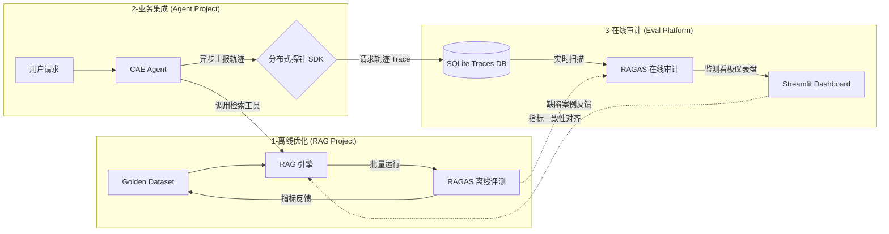
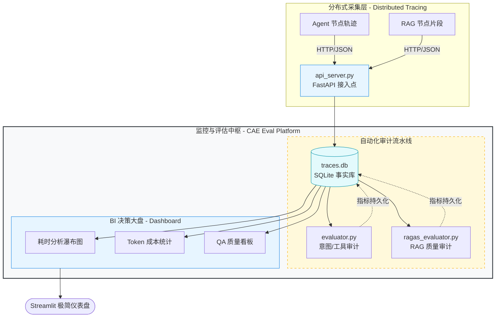

# CAE-Observability & RAGOps 质量治理中枢

本项目是一个面向 CAE 仿真智能体（Agent）的 **工业级可观测性与 RAG 自动化评估平台**。通过建立“研发优化、业务集成、在线审计”的三位一体闭环，解决了 RAG 系统在生产环境下质量难量化、幻觉难监控、成本难核算的痛点。

---

## 🏗️ 三位一体系统架构 (System Architecture)

该体系由三个深度协同的项目组成，实现了从算法研发到在线监控的完整工程治理闭环。

---

## 🗺️ 平台内部运行拓扑 (Internal Topology)

---

## 🌟 核心亮点 (Project Highlights)

### 1. 闭环式 RAGOps 治理逻辑
- **离线 Benchmarking (研发期)**：在 `CAE_RAG_project` 中利用 50+ 真实工况考题组成的“黄金观测集”，针对 **检索精准率 (Context Precision)** 和 **检索召回率 (Context Recall)** 进行量化压测，驱动混合检索与重排算法的优化。
- **在线 Observability (运行期)**：在智能体现身实战时，系统会自动抓取 RAG 工具的输出片段。通过 RAGAS 的 **忠实度 (Faithfulness)** 评估，在无参考答案的情况下检测模型幻觉，确保仿真输出的专业严谨性。

### 2. 标准化的分布式链路追踪 (Distributed Tracing)
- **统一埋点协议**：定义了全局标准的 RAG 工具调用契约（`lookup_cae_knowledge`），确保监控中枢能够自动识别并审计任何版本的 Agent 行为。
- **细粒度成本审计**：集成了 **Token 级成本核算** 与 **Span 级链路耗时分析**。支持从宏观（全平台 API 消耗趋势）到微观（定位某次推演中具体耗时过长的节点）的深度下钻。

### 3. 工程化可靠性保障 (Reliability)
- **自动熔断策略**：探针 SDK 具备超长 Payload (5k+ 字符) 自动截断保护，防止由于 RAG 召回文本过大撑爆监控 API。
- **静默降级逻辑**：针对网络波动，监控 SDK 具备降级异步处理机制，确保可观测性逻辑绝不干扰 Agent 的主业务流程。

---

## 🛠️ 技术栈总结 (Technology Stack)

| 维度 | 技术选型 | 核心价值 |
| :--- | :--- | :--- |
| **Orchestration** | **LangChain / LangGraph** | 构建高度受控的 Agent 状态机，确保推演路径可回溯、可复现。 |
| **Evaluation** | **RAGAS (Industrial Standard)** | 量化 RAG 质量的核心指标，实现基于 LLM-as-a-Judge 的自动化审计。 |
| **Storage** | **Chroma DB / SQLite** | 向量语义检索与结构化追踪数据各司其职，支撑多维数据分析。 |
| **Visuals** | **Streamlit / BI Dashboard** | 极简的低代码可视化方案，快速将冷数据转化为业务决策依据。 |
| **Network** | **FastAPI / HTTPX** | 高性能异步日志上报接口，支撑多端 Agent 并行接入。 |

---

## 📂 核心组件解析

| 文件名 | 职能角色 | 技术亮点 |
| :--- | :--- | :--- |
| `api_server.py` | **监控接入端 (Collector)** | 负责接收分布式 Agent 发来的 Trace/Span 数据，实现异步持久化。 |
| `evaluator.py` | **意图审计引擎** | 通过裁判模型对 Agent 的意图判断、工具选择进行 1-5 分的自动化对标。 |
| `ragas_evaluator.py`| **RAG 质量专家** | 调用 RAGAS 权重模型，专注于 Faithfulness 与 Relevancy 分数的实时审计。 |
| `dashboard.py` | **BI 可视化大盘** | 提供耗时瀑布图、Token 分布、成功率波动等核心 KPI 的实时看板。 |

---

## 🚀 启动指引

1. **后端数据采集器**: `python api_server.py`
2. **可视化监测大盘**: `streamlit run dashboard.py`
3. **查看开发报告**: 项目提供 `technical_report.md` 供参考。

---

> [!TIP]
> **简历亮点建议**：该项目重点展示了您在 **“AI 系统工程化落地”** 方面的思考。不仅关注模型本身的输出，更关注整个检索链条的 **可测量性**、**可观测性** 与 **持续交付质量**。
