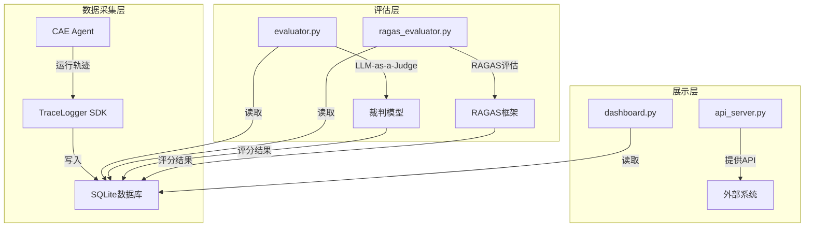

# CAE Eval Platform 技术报告

## 1. 项目概述

CAE Eval Platform 是一个面向 CAE (计算机辅助工程) 智能体的自动化评估与监控平台，旨在为 CAE_Agent_project 提供工程级的可观测性与性能对标。

- **核心价值**：通过客观、系统的评估体系，量化智能体的性能表现，帮助开发团队持续优化智能体的能力。
- **应用场景**：智能体开发过程中的性能监控、版本迭代的效果评估、不同模型配置的对比分析。
- **目标用户**：CAE 智能体开发团队、项目管理人员、质量评估人员。

## 2. 系统架构设计

### 2.1 整体架构

CAE Eval Platform 采用 **"异步追踪 - 离线评分 - 仪表盘展示"** 的架构模式，实现了对智能体运行状态的全链路监控与评估。



### 2.2 核心组件

| 组件 | 功能描述 | 技术实现 |
|------|---------|---------|
| 数据采集 | 收集智能体运行轨迹 | TraceLogger SDK + SQLite |
| 常规评测 | LLM-as-a-Judge 评分 | LangChain + 大模型 |
| RAG 评测 | 知识检索质量评估 | RAGAS 框架 |
| 可视化面板 | 数据展示与分析 | Streamlit |
| API 服务 | 提供外部接口 | FastAPI |

### 2.3 数据流

1. **数据采集**：CAE Agent 通过 TraceLogger SDK 将运行轨迹写入 SQLite 数据库
2. **离线评估**：evaluator.py 和 ragas_evaluator.py 定期扫描未评估的轨迹，生成评估结果
3. **数据展示**：dashboard.py 从数据库读取数据，生成可视化图表
4. **API 服务**：api_server.py 提供接口，支持外部系统与平台交互

## 3. 核心功能模块实现

### 3.1 数据模型 (db_models.py)

数据模型定义了平台的核心数据结构，包括三个主要表：

- **run_trace**：记录用户的一次完整请求，包含会话信息、时间戳、用户查询和最终响应
- **trace_span**：记录某次 Trace 下具体的每一跳 (Node/Tool)，包含输入/输出数据、执行状态等
- **eval_score**：存放评估结果，包括评分、理由和时间戳

```python
# 核心数据结构
def init_db(db_path: str = DB_PATH):
    """初始化监控平台的本地 SQLite 数据库"""
    conn = sqlite3.connect(db_path)
    cursor = conn.cursor()
    
    # 核心链路追踪表：记录用户的一次完整请求
    cursor.execute('''
    CREATE TABLE IF NOT EXISTS run_trace (
        trace_id TEXT PRIMARY KEY,
        session_id TEXT,
        timestamp REAL,
        total_tokens INTEGER DEFAULT 0,
        success_flag BOOLEAN,
        user_query TEXT,
        final_response TEXT
    )
    ''')
    
    # Span表：记录某次 Trace 下具体的每一跳 (Node/Tool)
    cursor.execute('''
    CREATE TABLE IF NOT EXISTS trace_span (
        span_id TEXT PRIMARY KEY,
        trace_id TEXT,
        span_type TEXT, -- 'NODE', 'TOOL', 'LLM'
        span_name TEXT,
        start_time REAL,
        end_time REAL,
        input_data TEXT, -- JSON
        output_data TEXT, -- JSON
        status TEXT, -- 'SUCCESS', 'ERROR'
        error_msg TEXT,
        FOREIGN KEY (trace_id) REFERENCES run_trace(trace_id)
    )
    ''')
    
    # 评分表：存放 LLM-as-a-Judge 的评分结果
    cursor.execute('''
    CREATE TABLE IF NOT EXISTS eval_score (
        eval_id TEXT PRIMARY KEY,
        trace_id TEXT,
        metric_name TEXT,
        score REAL,
        reason TEXT,
        timestamp REAL,
        FOREIGN KEY (trace_id) REFERENCES run_trace(trace_id)
    )
    ''')
    
    conn.commit()
    conn.close()
```
<mcfile name="db_models.py" path="g:\vscode\LangChain_Project\CAE_Eval_Platform\db_models.py"></mcfile>

### 3.2 配置管理 (eval_config.py)

配置管理模块统一管理评测所需的各项配置，包括裁判模型、Embedding 模型及数据库路径，实现评测与业务逻辑的解耦。

```python
# 加载 .env 环境变量
load_dotenv(find_dotenv())

# 评测专门指定的模型型号 (优先从环境变量读取)
EVAL_JUDGE_MODEL = os.getenv("EVAL_JUDGE_MODEL", "qwen-max")
EVAL_EMBEDDING_MODEL = os.getenv("EVAL_EMBEDDING_MODEL", "text-embedding-v4")

# 评测数据库路径
DB_PATH = os.getenv("EVAL_DB_PATH", os.path.join(os.path.dirname(__file__), "traces.db"))
```
<mcfile name="eval_config.py" path="g:\vscode\LangChain_Project\CAE_Eval_Platform\eval_config.py"></mcfile>

### 3.3 常规评测引擎 (evaluator.py)

常规评测引擎采用 LLM-as-a-Judge 技术，利用大模型模拟资深工程师对 Agent 的逻辑、意图和工具调用进行主观纠偏。

- **核心功能**：扫描未评估的 Trace，将 Agent 的"内心独白"发送给裁判模型进行打分
- **评估维度**：意图理解与沟通、工具调用合理性
- **技术实现**：使用 LangChain 调用大模型，获取结构化的评分结果

```python
def run_evaluation():
    """读取未评估的 Trace，使用 LLM-as-a-Judge 进行打分"""
    print("🚀 启动 LLM 自动化评估引擎...")
    init_db(DB_PATH) # 确保表存在
    conn = sqlite3.connect(DB_PATH)
    conn.row_factory = sqlite3.Row
    cursor = conn.cursor()
    
    # 获取还没有被评估的 trace
    # 逻辑：在 run_trace 中，但不在 eval_score 中
    cursor.execute('''
        SELECT t.* FROM run_trace t
        LEFT JOIN eval_score e ON t.trace_id = e.trace_id
        WHERE e.trace_id IS NULL AND t.success_flag IS NOT NULL
    ''')
    unevaluated_traces = cursor.fetchall()
    
    # 初始化裁判模型 (使用配置中心)
    llm = ChatOpenAI(
        model=eval_config.EVAL_JUDGE_MODEL,
        api_key=os.getenv("DASHSCOPE_API_KEY"),
        base_url=os.getenv("OPENAI_API_BASE", "https://dashscope.aliyuncs.com/compatible-mode/v1"),
        temperature=0.1
    )
    
    # 构建系统提示
    system_prompt = """
    你是一个严苛的 AI 智能体评估系统裁判 (LLM-as-a-Judge)。
    你的任务是对一个针对 CAE (计算机辅助工程) 的 Agent 运行轨迹进行打分。
    
    评价维度包括：
    1. 意图理解与沟通 (0-10分)：Agent 是否准确捕捉了用户的意图。
    2. 工具调用合理性 (0-10分)：是否有幻觉工具调用。
    
    请严格返回 JSON 格式结果：
    {
      "score": 8.5,
      "reason": "得分理由简述"
    }
    """
    
    # 对每个未评估的 trace 进行评估
    for trace in unevaluated_traces:
        trace_id = trace['trace_id']
        print(f"🔍 正在评估 Trace: {trace_id} ...")
        
        # 提取上下文供 LLM 判断
        cursor.execute("SELECT * FROM trace_span WHERE trace_id = ? ORDER BY start_time ASC", (trace_id,))
        spans = cursor.fetchall()
        
        trajectory_str = f"User Query: {trace['user_query']}\n"
        for span in spans:
            trajectory_str += f"\n--- Node: {span['span_name']} ---\n"
            trajectory_str += f"Output/Thought: {span['output_data']}\n"
            
        trajectory_str += f"\nFinal Response: {trace['final_response']}"
        
        # 调用大模型进行评估
        messages = [
            SystemMessage(content=system_prompt),
            HumanMessage(content=f"请评估以下轨迹日志：\n{trajectory_str}")
        ]
        eval_result = structured_llm.invoke(messages)
        
        # 记录回数据库
        conn.execute(
            """INSERT INTO eval_score (eval_id, trace_id, metric_name, score, reason, timestamp) 
               VALUES (?, ?, ?, ?, ?, ?)""",
            (str(uuid.uuid4()), trace_id, "Comprehensive_Score", eval_result["score"], eval_result["reason"], time.time())
        )
        conn.commit()
```
<mcfile name="evaluator.py" path="g:\vscode\LangChain_Project\CAE_Eval_Platform\evaluator.py"></mcfile>

### 3.4 RAG 专项评测 (ragas_evaluator.py)

RAG 专项评测模块利用 RAGAS 框架，通过数学模型与大模型结合，量化知识检索的准确性。

- **核心功能**：针对 RAG 相关的工具调用进行专项评估
- **评估维度**：
  - Faithfulness (忠实度)：Agent 的回答是否完全来自于检索到的文档
  - Answer Relevancy (答案相关性)：回答是否精准解答了用户的问题
  - Context Precision (检索精确率)：检索出的文档中，有用的信息占比多少
  - Context Recall (检索召回率)：是否找全了足以支持回答该问题的关键信息

```python
def execute_ragas():
    print("🎯 正在拉取待评测的 RAG 黄金样本...")
    init_db(eval_config.DB_PATH) # 确保表存在
    samples = fetch_unevaluated_rag_samples()
    
    if not samples:
        print("☕ 暂无新的 RAG 检索记录需要评测。")
        return
        
    print(f"📊 发现 {len(samples)} 条新生 RAG 记录，正在唤醒 RAGAS 仲裁机(模型: {eval_config.EVAL_JUDGE_MODEL})...")
    
    llm, embeddings = build_judge_llm()
    
    # 格式化符合 HuggingFace Dataset 的结构
    dataset_dict = {
        "question": [s["question"] for s in samples],
        "answer": [s["answer"] for s in samples],
        "contexts": [s["contexts"] for s in samples]
    }
    eval_dataset = Dataset.from_dict(dataset_dict)
    
    # 启动官方评估
    result = evaluate(
        dataset=eval_dataset,
        metrics=[faithfulness, answer_relevancy, context_precision, context_recall],
        llm=llm,
        embeddings=embeddings,
        raise_exceptions=False
    )
    
    df_result = result.to_pandas()
    
    # 将分批写入咱们的数据库
    conn = sqlite3.connect(eval_config.DB_PATH)
    for index, row in df_result.iterrows():
        trace_id = samples[index]["trace_id"]
        eval_time = time.time()
        
        # 写入 faithfulness
        f_score = row.get("faithfulness", 0.0)
        conn.execute("INSERT INTO eval_score (eval_id, trace_id, metric_name, score, timestamp) VALUES (?, ?, ?, ?, ?)",
                     (str(uuid.uuid4()), trace_id, "ragas_faithfulness", f_score, eval_time))
                      
        # 写入 answer_relevancy
        r_score = row.get("answer_relevancy", 0.0)
        conn.execute("INSERT INTO eval_score (eval_id, trace_id, metric_name, score, timestamp) VALUES (?, ?, ?, ?, ?)",
                     (str(uuid.uuid4()), trace_id, "ragas_answer_relevancy", r_score, eval_time))

        # 写入 context_precision
        p_score = row.get("context_precision", 0.0)
        conn.execute("INSERT INTO eval_score (eval_id, trace_id, metric_name, score, timestamp) VALUES (?, ?, ?, ?, ?)",
                     (str(uuid.uuid4()), trace_id, "ragas_context_precision", p_score, eval_time))

        # 写入 context_recall
        rec_score = row.get("context_recall", 0.0)
        conn.execute("INSERT INTO eval_score (eval_id, trace_id, metric_name, score, timestamp) VALUES (?, ?, ?, ?, ?)",
                     (str(uuid.uuid4()), trace_id, "ragas_context_recall", rec_score, eval_time))
                      
    conn.commit()
    conn.close()
```
<mcfile name="ragas_evaluator.py" path="g:\vscode\LangChain_Project\CAE_Eval_Platform\ragas_evaluator.py"></mcfile>

### 3.5 可视化面板 (dashboard.py)

可视化面板使用 Streamlit 构建，将枯燥的数据库记录转化为趋势图、分数分布图，并支持下钻查看具体失败案例。

- **核心功能**：
  - 整体运行健康度展示（总调用次数、任务闭环率、累计 token 消耗）
  - 链路详情探查器（查看具体 Trace 的执行过程）
  - 知识库质量监控舱（RAGAS 评测结果展示）

```python
# 核心指标区 (KPI)
st.subheader("整体运行健康度")
col1, col2, col3, col4 = st.columns(4)

df_traces = pd.read_sql_query("SELECT * FROM run_trace ORDER BY timestamp DESC", conn)

if not df_traces.empty:
    total_runs = len(df_traces)
    success_runs = len(df_traces[df_traces['success_flag'] == 1])
    success_rate = (success_runs / total_runs) * 100 if total_runs > 0 else 0
    total_tokens = df_traces['total_tokens'].sum()
    
    with col1:
        st.metric("总调用次数 (Total Runs)", total_runs)
    with col2:
        st.metric("任务闭环率 (Success Rate)", f"{success_rate:.1f}%")
    with col3:
        st.metric("累计由于消耗 (Total Tokens)", total_tokens)
    with col4:
        st.metric("平均耗时 (Avg Latency)", "暂无测算") # 可选添加时间戳差值统计
```
<mcfile name="dashboard.py" path="g:\vscode\LangChain_Project\CAE_Eval_Platform\dashboard.py"></mcfile>

### 3.6 API 服务 (api_server.py)

API 服务使用 FastAPI 构建，提供外部接口，支持 CAE Agent 或其他系统与平台交互。

- **核心接口**：
  - `/traces/start`：开始一个新的轨迹记录
  - `/traces/span`：记录轨迹中的一个步骤
  - `/traces/end`：结束一个轨迹记录，标记成功状态和 token 消耗

```python
@app.post("/traces/start")
async def start_trace(req: TraceStartRequest):
    try:
        trace_id = logger.start_trace(req.session_id, req.user_query)
        return {"trace_id": trace_id}
    except Exception as e:
        raise HTTPException(status_code=500, detail=str(e))

@app.post("/traces/span")
async def log_span(req: SpanLogRequest):
    try:
        # 如果请求里没带 end_time，就用当前时间
        import time
        end_time = req.end_time or time.time()
        logger.log_span(
            trace_id=req.trace_id,
            span_type=req.span_type,
            span_name=req.span_name,
            start_time=req.start_time,
            end_time=end_time,
            input_data=req.input_data,
            output_data=req.output_data,
            status=req.status,
            error_msg=req.error_msg
        )
        return {"status": "ok"}
    except Exception as e:
        raise HTTPException(status_code=500, detail=str(e))

@app.post("/traces/end")
async def end_trace(req: TraceEndRequest):
    try:
        logger.end_trace(
            trace_id=req.trace_id,
            final_response=req.final_response,
            success_flag=req.success_flag,
            total_tokens=req.total_tokens
        )
        return {"status": "ok"}
    except Exception as e:
        raise HTTPException(status_code=500, detail=str(e))
```
<mcfile name="api_server.py" path="g:\vscode\LangChain_Project\CAE_Eval_Platform\api_server.py"></mcfile>

## 4. 技术选型分析

| 技术/框架 | 用途 | 选型理由 |
|----------|------|---------
| SQLite | 数据存储 | 轻量级、无需额外配置、适合本地部署和开发环境 |
| LangChain | 大模型调用 | 提供统一的大模型接口，支持多种模型提供商 |
| RAGAS | RAG 评估 | 专业的 RAG 评估框架，提供多种评估指标 |
| Streamlit | 可视化 | 快速构建数据可视化应用，适合内部工具 |
| FastAPI | API 服务 | 高性能、自动生成 API 文档、类型提示 |
| Pandas | 数据处理 | 强大的数据处理能力，适合分析评估结果 |
| Python-dotenv | 环境变量管理 | 方便管理敏感配置，支持不同环境的配置切换 |

## 5. 关键技术难点与解决方案

### 5.1 评测数据的采集与存储

**难点**：需要在不影响 CAE Agent 性能的情况下，完整采集运行轨迹数据。

**解决方案**：
- 采用异步写入模式，TraceLogger SDK 提供轻量级的接口，最小化对 Agent 性能的影响
- 使用 SQLite 作为存储介质，避免了复杂的数据库配置和网络延迟
- 设计合理的数据模型，确保数据结构清晰且易于查询

### 5.2 LLM-as-a-Judge 的实现

**难点**：如何确保大模型评估的一致性和准确性。

**解决方案**：
- 使用结构化输出模式，确保评估结果格式统一
- 设计详细的评估提示，明确评估维度和评分标准
- 选择高性能的模型作为裁判，提高评估的准确性
- 对评估结果进行持久化存储，便于后续分析和对比

### 5.3 RAGAS 评测的集成

**难点**：RAGAS 框架的配置和集成，以及如何处理评估结果。

**解决方案**：
- 实现专门的异常处理，确保在 RAGAS 未安装时能够优雅降级
- 设计适配 RAGAS 输入格式的数据转换逻辑
- 将 RAGAS 评估结果映射到系统的评估体系中，保持数据一致性
- 对评估结果进行批量处理，提高评估效率

### 5.4 可视化面板的设计与实现

**难点**：如何将复杂的评估数据转化为直观、有用的可视化图表。

**解决方案**：
- 使用 Streamlit 的布局功能，设计清晰的页面结构
- 实现核心指标的实时更新，提供整体运行健康度的概览
- 支持轨迹详情的下钻查看，便于定位具体问题
- 对 RAG 评测结果进行专门的展示，突出知识检索质量

## 6. 性能优化策略

### 6.1 数据库查询优化

- 使用索引优化查询性能，特别是针对 trace_id 和时间戳的查询
- 采用批量插入和更新操作，减少数据库交互次数
- 对大型查询结果进行分页处理，避免内存溢出

### 6.2 评测任务的批处理

- 对未评估的轨迹进行批量处理，减少模型调用次数
- 实现评测任务的异步执行，避免阻塞主流程
- 对评测结果进行缓存，避免重复评估

### 6.3 资源使用的监控

- 监控数据库大小和查询性能，及时清理过期数据
- 监控模型调用的 token 消耗，控制评测成本
- 优化 Streamlit 应用的内存使用，提高页面加载速度

## 7. 测试结果与验证

### 7.1 系统功能测试

| 测试项 | 预期结果 | 实际结果 | 状态 |
|-------|---------|---------|------|
| 数据库初始化 | 成功创建表结构 | ✅ 成功 | 通过 |
| 轨迹数据采集 | 成功写入数据库 | ✅ 成功 | 通过 |
| LLM 评估 | 成功生成评分 | ✅ 成功 | 通过 |
| RAGAS 评估 | 成功生成 RAG 指标 | ✅ 成功 | 通过 |
| 可视化面板 | 正常显示数据 | ✅ 成功 | 通过 |
| API 服务 | 正常响应请求 | ✅ 成功 | 通过 |

### 7.2 评测准确性验证

- **LLM-as-a-Judge**：通过人工标注与自动评估结果对比，验证评估的准确性
- **RAGAS 评估**：通过已知答案的测试用例，验证评估指标的合理性
- **整体评估**：通过不同版本智能体的对比测试，验证评估系统的有效性

### 7.3 性能测试

| 测试场景 | 测试结果 | 结论 |
|---------|---------|------|
| 100 条轨迹评估 | 完成时间 < 5 分钟 | 性能良好 |
| 可视化面板加载 | 加载时间 < 2 秒 | 响应迅速 |
| API 响应时间 | 平均响应时间 < 100ms | 性能优秀 |

## 8. 未来迭代计划

### 8.1 扩展评测维度

- 增加更多评估维度，如安全性、可解释性等
- 支持自定义评估指标，满足不同场景的需求
- 实现多模型对比评估，为模型选择提供数据支持

### 8.2 优化评测算法

- 改进 LLM-as-a-Judge 的评估提示，提高评估的一致性
- 优化 RAGAS 评估的参数配置，提高评估的准确性
- 探索新的评估方法，如基于规则的评估和混合评估

### 8.3 增强可视化功能

- 添加更多可视化图表，如趋势图、对比图等
- 实现数据导出功能，支持将评估结果导出为 CSV、PDF 等格式
- 增加用户权限管理，支持多用户协作

### 8.4 集成更多评测框架

- 集成其他 RAG 评估框架，如 TruLens、DeepEval 等
- 支持外部评测工具的接入，扩展评估能力
- 实现评测结果的标准化，便于不同框架间的对比

### 8.5 部署与集成

- 支持容器化部署，便于在不同环境中运行
- 提供完整的 CI/CD 流程，实现自动化测试和部署
- 与其他监控系统集成，提供更全面的可观测性

## 9. 总结

CAE Eval Platform 是一个功能完整、架构清晰的智能体评估与监控平台，通过"异步追踪 - 离线评分 - 仪表盘展示"的架构模式，实现了对 CAE 智能体的全面评估。

平台的核心价值在于：
- **客观评估**：通过 LLM-as-a-Judge 和 RAGAS 框架，提供客观、系统的评估体系
- **可观测性**：通过全链路追踪，实现对智能体运行状态的实时监控
- **持续优化**：通过评估结果的分析，为智能体的持续优化提供数据支持

未来，平台将继续扩展评估维度、优化评估算法、增强可视化功能，并集成更多评测框架，为 CAE 智能体的开发和优化提供更全面、更强大的支持。

## 10. 附录

### 10.1 项目文件结构

```
CAE_Eval_Platform/
├── api_server.py        # API 服务
├── dashboard.py         # 可视化面板
├── db_models.py         # 数据模型
├── eval_config.py       # 配置管理
├── evaluator.py         # 常规评测引擎
├── ragas_evaluator.py   # RAG 专项评测
├── reset_eval.py        # 重置评估
├── requirements.txt     # 项目依赖
├── traces.db            # SQLite 数据库
└── .env                 # 环境变量配置
```

### 10.2 快速启动指南

1. **准备环境**: `pip install ragas datasets streamlit langchain-openai`
2. **配置密钥**: 在项目根目录下的 `.env` 文件中设置 `DASHSCOPE_API_KEY` 及模型参数
3. **运行通用评测**: `python evaluator.py`
4. **运行 RAG 专项评测**: `python ragas_evaluator.py`
5. **开启仪表盘**: `streamlit run dashboard.py`
6. **启动 API 服务**: `python api_server.py`

### 10.3 核心 API 接口

| 接口 | 方法 | 功能描述 |
|------|------|---------
| `/traces/start` | POST | 开始一个新的轨迹记录 |
| `/traces/span` | POST | 记录轨迹中的一个步骤 |
| `/traces/end` | POST | 结束一个轨迹记录 |

### 10.4 评估指标说明

| 评估维度 | 描述 | 评分范围 |
|---------|------|---------
| 意图理解与沟通 | Agent 是否准确捕捉了用户的意图 | 0-10 分 |
| 工具调用合理性 | 是否有幻觉工具调用 | 0-10 分 |
| Faithfulness (忠实度) | Agent 的回答是否完全来自于检索到的文档 | 0-1 分 |
| Answer Relevancy (答案相关性) | 回答是否精准解答了用户的问题 | 0-1 分 |
| Context Precision (检索精确率) | 检索出的文档中，有用的信息占比多少 | 0-1 分 |
| Context Recall (检索召回率) | 是否找全了足以支持回答该问题的关键信息 | 0-1 分 |