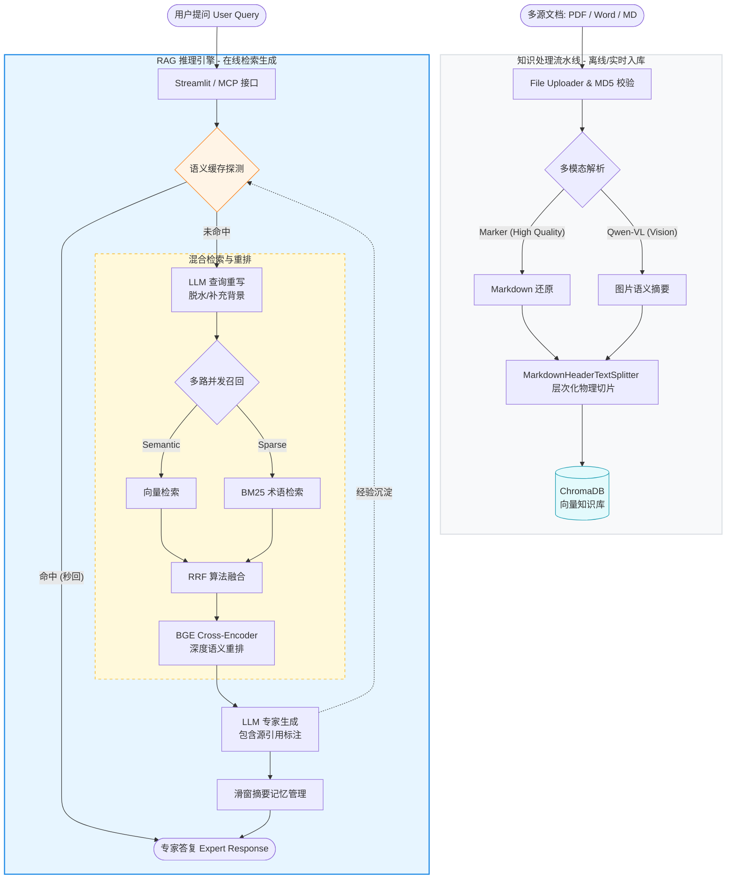

# CAE_RAG_project: 工业级仿真工程 RAG 专家系统

这是一个专为 **CAE（计算机辅助工程）** 领域打造的检索增强生成（RAG）系统。它不仅是一个简单的文档问答工具，更是一套集成了多模态解析、多路召回重排、语义长效缓存以及流式记忆压缩的工业级知识服务体系。

---

## 🏗️ 核心系统架构

系统采用模块化分层架构，确保了从数据入库到知识消费的高效协同：

1.  **多源数据感知层 (`file_uploader`)**：支持 PDF、Word、Markdown 等多格式，集成底层 OCR 与视觉模型解析图像/公式。
2.  **双层向量存储层 (`knowledge_base`)**：基于 ChromaDB，实现技术文档库（原子知识）与语义缓存库（经验结晶）的物理隔离与逻辑统一。
3.  **混合检索重排引擎 (`retriever_service`)**：
    *   **召回阶段**：向量检索（语义）+ BM25（关键词）多路并发。
    *   **排序阶段**：基于 BGE Cross-Encoder 的深度交叉语义评分。
4.  **智能记忆调度器 (`file_history_store`)**：内建 LLM 驱动的滑窗摘要机制，实现长对话下“高密脉络”的动态提纯。
5.  **推理与指挥中心 (`rag.py`)**：基于 LCEL 编排的闭环流水线，负责查询重写、上下文装配及最终决策。

---

## 🗺️ 系统拓扑图 (System Topology)

---

## 🚀 运转逻辑与工作流

### 1. 知识入库流 (Data Ingestion Pipeline)
*   **指纹截击**：提取文件二进制 MD5，瞬间拦截重复文档。
*   **多模态解析**：PDF 经过 **Marker** 还原、Word 通过 **Unstructured** 提取、图片由 **Qwen-VL** 深度识图并注入文本摘要。
*   **结构化手术刀**：利用 `MarkdownHeaderTextSplitter` 按照文档标题（H1-H3）进行层级剥离，保留工程规范的父子关系。

### 2. 在线推理流 (Query Execution Flow)
1.  **缓存探针**：提问入场，先向 `Semantic Cache` 抛出探针。命中及短路（0 Token 秒回），未命中则深入库区。
2.  **查询重写**：结合历史对话，将“它如何设置”优化为“Abaqus C3D8R 单元的减缩积分设置规范”。
3.  **多路召回**：向量库找“意思”，BM25 找“术语”，通过 **RRF 算法** 融合初步候选。
4.  **交叉重排**：利用精排模型对 Top-10 候选进行针刺式评估，仅保留最精准的 Top-3 喂给大模型。
5.  **专家生成**：大模型基于强化的上下文，生成带来源引用的专业解答，并更新对话记忆。

---

## 📦 核心依赖清单

| 类别 | 核心技术栈 | 职责 |
| :--- | :--- | :--- |
| **RAG 骨架** | LangChain / LCEL | 负责组件的链式编排与会话历史管理。 |
| **大模型能力** | 阿里百炼 (Qwen-Max/Turbo/VL) | 提供对话逻辑、查询重写、视觉解析及摘要压缩。 |
| **向量数据库** | ChromaDB | 提供原子知识片段与语义缓存的高性能存取。 |
| **混合检索** | Jieba / Rank-BM25 | 为系统提供稳定、精准的中文术语搜索能力。 |
| **深度解析** | Marker / Unstructured | 负责将不同格式的非结构化数据转化为高纯度 Markdown。 |
| **重排模型** | BAAI/bge-reranker-base | 解决向量检索在工程长文本中“召回多但精度弱”的痛点。 |
| **Web 界面** | Streamlit | 构建极简、高效的工程知识管理与对话控制台。 |

---

---

## 各代码文件功能说明

### `app.py` — CAE 智能对话门户 (Frontend)

这是用户直接互动的核心界面，基于 Streamlit 构建，实现了流式对话与系统运维的集成。
- **动态会话隔离**：
    - **UUID 机制**：系统通过 `uuid.uuid4()` 为每个新打开的浏览器标签页生成唯一的 `session_id`。这解释了为何 `chat_history` 目录下存在大量唯一标识的文件，确保不同用户/不同窗口之间的对话互不干扰。
    - **状态保持**：利用 `st.session_state` 维护即时的 UI 聊天记录。
- **资源单例化**：通过 `@st.cache_resource` 装饰器，确保沉重的 RAG 引擎在整个应用生命周期中只初始化一次，极大提升了加载速度。
- **运维侧边栏**：
    - **索引同步**：提供手动同步按钮，将磁盘上的 BM25 稀疏索引与内存/向量库中的最新文档进行强制对齐。
    - **记忆清理**：支持一键清空当前 ID 对应的历史文件，实现“记忆重启”。
- **流式响应**：对接 `rag_engine.chain.stream` 接口，配合 `st.write_stream` 实现打字机式的极致用户体验。

### `config_data.py` — 全局配置中心

该文件作为系统的“仪表盘”，集中管理所有可调参数，实现了业务逻辑与配置的解耦。
- **API & 安全**：管理 DashScope (百炼) 的 API Key、Base URL 以及 LangSmith 可观测性开关。
- **数据结构参数**：定义了向量库路径、集合名称以及 `chunk_size`、`chunk_overlap` 等关键切片算子，直接影响检索精度。
- **模型选型**：
    - **Embedding**: 默认使用 `text-embedding-v4`。
    - **Chat**: 默认使用 `qwen-turbo`。
    - **VLM**: 默认使用 `qwen-vl-max` 用于视觉分析。
- **检索阈值**：设置 `similarity_threshold`（相似度判定线），用于阻断低相关度的 RAG 噪音。

### `file_history_store.py` — 带有摘要压缩与并发安全锁的会话存储

这是系统的“短期记忆调度中心”，负责管理多轮对话历史，并确保不爆掉 Token 上限。
- **并发排它锁机制 (FileLock)**：
    - **安全机制**：基于纯 Python 实现的跨平台排它文件锁（`FileLock`），保护对话记录的读取、写入及清空操作，有效阻断并发访问下的文件 I/O 竞争及数据损坏。
    - **死锁恢复**：若锁文件存在超过 10 秒（判定为异常死锁残留），后续请求会自动物理清理并释放，确保服务长效可用。
- **滑窗摘要机制 (Sliding Window Summary)**：
    - **触发阈值**：当 `messages` 数量超过 `max_messages` (默认 6 条，约 3 轮对话) 时启动冷缩压缩。
    - **折叠式总结逻辑**：保留最近 2 轮对话作为精确上下文，其余历史消息投入 LLM 折叠式提纯，提取出场景参数、工程共识和规范条目。
- **系统提示词注入**：
    - 总结后的“高密结晶”会以 `SystemMessage` 的形式重新注入历史记录的首位，并标注 `【前文情境摘要脉络】` 以维持长效上下文大背景。
- **文件持久化**：
    - 采用 JSON 序列化方案，将对话按 `session_id` 存储在本地 `/chat_history` 目录下，支持跨重启会话续接。

### `semantic_cache.py` — 具有自失效与 LRU 淘汰的语义缓存盾牌

这是系统的“长期经验记忆”与降本组件，拦截语义相似的提问。
- **语义相似度短路**：利用向量相似度截获“意思相近”的提问。若历史经验中存在高度重合的答案（如相似度得分 > threshold），则秒回缓存结果，0 Token 损耗。
- **TTL 时效过期校验**：
    - **过期判定**：缓存文档元数据中包含 `create_time` 时间戳，在检索命中时检测是否超过失效时间 `TTL_SECONDS`（默认 7 天）。
    - **物理清理**：若已过期，自动从 Chroma 缓存集合中触发物理删除，重新向下流转检索，防范陈旧过期知识污染。
- **LRU 缓存容量控制与淘汰**：
    - **最大容量**：设定缓存容量上限 `MAX_CACHE_SIZE = 500` 条。
    - **老旧清理**：当数量溢出时，自动触发 LRU 淘汰机制，按创建时间排序，强制物理删除最老的前 50 条记录，保证磁盘开销与检索性能的平衡。

### `mcp_server_entry.py` — CAE RAG 的外部接口人

通过 Model Context Protocol (MCP) 协议，将 RAG 能力作为工具暴露给外部 Agent（如 Claude Desktop）。
- **探针逻辑 (The Probe)**：
    - 在执行复杂的向量库检索前，系统会先向 `semantic_cache` 抛出一次检索请求（即“探针”）。
    - 探针若命中经验大坝，则瞬间返回，不再触发布置在底层的密集计算任务。
- **混合检索集成**：若探针未命中，则通过 `retriever_service.search_and_rerank` 执行完整的混合检索与重排流程。
- **SSE 传输支持**：支持基于 Server-Sent Events 的标准化通信，方便作为微服务横向扩展。

### `file_uploader.py` — 知识库入库与管理控制台

该模块是知识库的数据入口层，提供了完整的**“上传-解析-清洗-注入”**流水线：
- **多格式解析引擎**：
    - **PDF**: 采用 `Marker` (marker_single) 模型进行深度解析，支持数学公式、表格和复杂布局的 Markdown 还原。
    - **Word (.docx)**: 集成 `Unstructured` 库进行结构化解析。
    - **文本 (MD/TXT)**: 原生支持读取，针对 TXT 增加了多编码（UTF-8/GBK）自适应探测。
- **核心逻辑与优化**：
    - **MD5 秒传机制**：对上传文件流进行哈希计算，若物理指纹已存在于知识库中则触发瞬间跳过。
    - **全局缓存锁 (Lazy Loading)**：通过 `@st.cache_resource` 实现 `KnowledgeBaseService` 的单例懒加载，确保模型只加载一次，节省显存并加快 UI 响应。
    - **实时监控**：利用 Streamlit 的容器和进度条实时反馈 Marker 解析日志和入库进度。
- **管理功能**：支持对已入库文件进行列表展示、元数据查看（切片数、指纹、时间）以及级联删除（同步清理向量库数据与 MD5 记录）。

### `knowledge_base.py` — 向量知识库后端服务

封装了基于 LangChain 和 ChromaDB 的核心数据管理逻辑：
- **混合分块策略 (Advanced Splitting)**：
    - **一级结构化手术刀**：通过 `MarkdownHeaderTextSplitter` 识别文档的 H1-H3 标题，保留文档的逻辑层级。
    - **二级递归字符补丁**：对一级分块后的长文本使用 `RecursiveCharacterTextSplitter` 进行按字节截断，防止超出 Embedding 模型上下文上限。
- **多模态视觉注入 (VLM Integration)**：
    - **图片感知**：自动探测文本中的 Markdown 图片标签。
    - **视觉摘要**：调用 `Qwen-VL` 大模型，提取工程图表（如应力图、网格划分图）的核心数据特征。
    - **特征融合**：将视觉描述回填至文本切片中，增强系统对非文字信息的检索召回率。
- **存储架构**：
    - 使用 `DashScopeEmbeddings` 生成语义向量。
    - 基于 `Chroma` 实现本地持久化存储，并支持复杂的 `where` 条件元数据过滤。

### `rag.py` — RAG 核心总线与会话执行引擎

这是系统的“总指挥部”，通过 LangChain Expression Language (LCEL) 将各个松散的模块编排成一条工业级的处理流水线。
- **查询重写链 (Query Rewrite)**：
    - **痛点解决**：解决用户提问中的代词（如“它”、“那个”）和省略语问题。
    - **逻辑**：利用重写 Prompt 结合历史对话上下文，将用户的原始提问“脱水”重构为一个独立、包含专业术语的搜索关键词，从而极大提升向量检索的精度。
- **专家级 QA 模板**：
    - 设计了严密的系统提示词，强制模型必须基于【参考资料】回答并**标注来源引用**（如 [资料 1]）。
    - 针对 CAE 场景，设置了“严禁主观臆断”和“逻辑推理边界”等约束条件。
- **全自动会话挂载**：
    - 使用 `RunnableWithMessageHistory` 动态绑定 `file_history_store`。
    - **感知式运行**：在每次推理前自动抓取历史，在推理后自动执行存储和摘要压缩，对上层应用透明。
- **可视化调试**：内建了 `print_prompt` 等监控节点，在控制台实时输出发送给大模型的最终报文，方便开发阶段进行 Prompt 工程调优。

### `retriever_service.py` — 两阶段混合检索重排引擎

这是 RAG 系统最核心的“过滤器”，负责在数百万字的数据海洋中精准定位答案。
- **BM25 序列化持久缓存 (pickle)**：
    - **启动加速**：首创 BM25 分词索引二进制离线序列化（`bm25_index.pkl`）机制。服务启动时优先从本地极速反序列化加载，避免全量从 Chroma 向量库读取和重复进行 jieba 分词的巨大计算负荷，**实现 0 毫秒级冷启动**。
    - **跨进程自动热重载**：在检索前自动检查本地 pickle 文件的修改时间戳（`mtime`）。一旦感知到有其他进程完成了增量入库写入，会自动执行热重载，确保数据强一致性。
- **增量式写入更新**：
    - **接口设计**：提供模块级增量追加接口 `append_to_bm25_pickle`，在 `knowledge_base.py` 写入 Chroma 向量库时同步自动调用，只对新文档片段做jieba分词追加，减少全量计算并实现自动更新。
- **第一阶段：多路召回 (Multi-Route Recall)**：
    - **向量检索 (Dense)**：利用基于 Chroma 的语义相似度寻找“意思相近”的内容。
    - **关键词检索 (Sparse)**：基于 `jieba` 分词和 `rank-bm25` 算法，寻找特定工程术语匹配的片段。
    - **RRF 融合 (Reciprocal Rank Fusion)**：将多路结果按倒数排名融合得分，综合考虑语义与关键词。
- **第二阶段：交叉重排 (Cross-Encoder Re-ranking)**：
    - **深度评估**：调用 `BAAI/bge-reranker-base` 模型，对第一阶段召回的前 10 个候选片段进行逐一打分。相比向量检索，重排器能识别更细微的逻辑一致性。
    - **精准输出**：过滤掉低分杂讯，仅输出经过重排验证后的 Top-K (默认 3 个) 最优片段供大模型使用。

