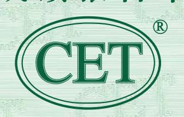

梅傲寒

西南交通大学

土木工程学院

522131200201280812

| 丛        | 试    |
|----------|------|
| <b>=</b> | LIA. |
|          | ,-4  |

510031251227615

| 510031251227615 |     |     |     |     |
|-----------------|-----|-----|-----|-----|
| 2025年6月         | 435 | 111 | 192 | 132 |

--

--

--

251251003001941

7HQX SOQM N76Y 4R2N

## 说 明

- 全国大学英语四、六级考试(CET)是由教育部主办 的全国统一考试,考试对象为在校大学生。考试内容 包括听、说、读、写、译等语言技能。 1.
- CET笔试考试时间为每年6月和12月;CET口试考试 时间为每年5月和11月。 2.
- 考生可登录中国教育考试网(www.neea.edu.cn)查 询、下载电子成绩报告单或自行办理纸质成绩证明。 电子成绩报告单和纸质成绩证明与纸质成绩报告单具 有同等效力。 3.

## 大学英语六级口语考试能力描述

| 优秀 | 能用英语就一般性话题清晰地阐述自己的 观点,明确地表达自己的态度;能开展深 入的讨论,发表具有一定深度的见解。语 言表达适切,自然流畅。 |
|----|-------------------------------------------------------------------------------|
| 良好 | 能用英语就一般性话题阐述自己的观点, 表明自己的态度;能开展较深入的讨论。 语言表达准确连贯。                         |
| 合格 | 能用英语就一般性话题进行交流;能参与 讨论。语言表达基本准确。                                            |