铁道标准设计 *Railway Standard Design* ISSN 1004-2954,CN 11-2987/U

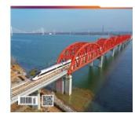

## 《铁道标准设计》网络首发论文

题目: 运营期膨胀岩高铁隧道底部结构动力响应及损伤规律研究

作者: 梅傲寒,魏荣华,张志强,苟潇

DOI: 10.13238/j.issn.1004-2954.202507230001

收稿日期: 2025-07-23 网络首发日期: 2025-12-11

引用格式: 梅傲寒,魏荣华,张志强,苟潇.运营期膨胀岩高铁隧道底部结构动力响应

及损伤规律研究[J/OL].铁道标准设计**.**

https://doi.org/10.13238/j.issn.1004-2954.202507230001

网络首发:在编辑部工作流程中,稿件从录用到出版要经历录用定稿、排版定稿、整期汇编定稿等阶 段。录用定稿指内容已经确定,且通过同行评议、主编终审同意刊用的稿件。排版定稿指录用定稿按照期 刊特定版式(包括网络呈现版式)排版后的稿件,可暂不确定出版年、卷、期和页码。整期汇编定稿指出 版年、卷、期、页码均已确定的印刷或数字出版的整期汇编稿件。录用定稿网络首发稿件内容必须符合《出 版管理条例》和《期刊出版管理规定》的有关规定;学术研究成果具有创新性、科学性和先进性,符合编 辑部对刊文的录用要求,不存在学术不端行为及其他侵权行为;稿件内容应基本符合国家有关书刊编辑、 出版的技术标准,正确使用和统一规范语言文字、符号、数字、外文字母、法定计量单位及地图标注等。 为确保录用定稿网络首发的严肃性,录用定稿一经发布,不得修改论文题目、作者、机构名称和学术内容, 只可基于编辑规范进行少量文字的修改。

出版确认:纸质期刊编辑部通过与《中国学术期刊(光盘版)》电子杂志社有限公司签约,在《中国 学术期刊(网络版)》出版传播平台上创办与纸质期刊内容一致的网络版,以单篇或整期出版形式,在印刷 出版之前刊发论文的录用定稿、排版定稿、整期汇编定稿。因为《中国学术期刊(网络版)》是国家新闻出 版广电总局批准的网络连续型出版物(ISSN 2096-4188,CN 11-6037/Z),所以签约期刊的网络版上网络首 发论文视为正式出版。

# 运营期膨胀岩高铁隧道底部结构动力响应及损伤规律研究

梅傲寒 1,2,魏荣华 1,2,张志强 1,2,苟潇 1,2

(1. 西南交通大学极端环境岩土和隧道工程智能建养全国重点实验室,成都 610031;2. 西南交通大 学土木工程学院,成都 610031)

摘要:运营期间由于列车荷载、围岩膨胀等因素的影响,膨胀岩高铁隧道底部结构常因动力损伤加剧而发生隧道结构下沉、 衬砌开裂破坏等安全危害。本文基于 Perzyna 弹黏塑性理论,引入动力损伤变量,推导考虑循环动荷载作用下的混凝土动 力疲劳损伤本构,建立列车动载-围岩-结构三维动力计算模型,研究隧道底部结构动力响应与全服役周期损伤演化规律。 研究结果表明,(1)隧底结构各项响应极值随隧道运营年限增长呈现出"前快后慢"的演化规律,即前 30 年快速增长,随 后增速放缓。(2)膨胀作用下隧底结构的动力响应增幅明显,隧道运营 100 年后加速度、最小主应力及结构内力的响应极 值相比无膨胀时皆增长 100%以上,同时安全系数降幅最大可达 89.8%,已低于规范要求的控制标准。(3)高铁隧道底部结 构的动力损伤演化规律呈现三阶段:阶段一局部初始损伤出现,随机性强且高度分散;阶段二损伤向四周扩散,从分散状 态发展为区域性汇聚;阶段三损伤沿隧道纵向和环向延伸,局部集中区域逐渐连通形成整体破坏。(4)膨胀作用大幅加速 隧底结构的动力损伤扩散,且受拉损伤影响更加显著,运营后期(100 年)受拉、受压损伤极值分别达到 0.984、0.877。

关键词:铁路隧道;疲劳损伤本构;膨胀围岩;列车振动荷载;动力响应;损伤发展

中图分类号: U25 文献标识码: A DOI:10.13238/j.issn.1004-2954.202507230001

## **Study on Dynamic Response and Damage Law of Bottom Structure of Expansive Rock High-speed Railway Tunnel in Operation Period**

MEI Aohan1,2 , WEI Ronghua1,2 , ZHANG Zhiqiang1,2, GOU Xiao1,2

(1.State Key Laboratory of Intelligent Geotechnics and Tunnelling, Southwest Jiaotong University, Chengdu 610031, China; 2. School of Civil Engineering, Southwest Jiaotong University, Chengdu 610031, China)

**Abstract:** During the operation period, due to the influence of train load, surrounding rock expansion and other factors, the bottom structure of expansive rock high-speed railway tunnel often suffers from safety hazards such as tunnel structure sinking and lining cracking failure due to the aggravation of dynamic damage. In this paper, based on Perzyna's elasto-viscoplastic theory, the dynamic damage variable is introduced, and the dynamic fatigue damage constitutive of concrete under cyclic dynamic load is derived. A three-dimensional dynamic calculation model of train dynamic load-surrounding rock-structure is established to study the dynamic response of the tunnel bottom structure and the damage evolution law of the whole service cycle. The results show that: (1) The response extremum of the tunnel bottom structure shows the evolution law of "fast before and slow after" with the increase of tunnel operation years, that is, the rapid growth in the first 30 years, and then the growth rate slows down; (2) Under the action of expansion, the dynamic response of the tunnel bottom structure increases significantly. After 100 years of operation, the response extreme values of acceleration, minimum principal stress and structural internal force increase by more than 100% compared with those without expansion. At the same time, the safety factor can be reduced by up to 89.8%, which is lower than the control standard required by the specification; (3) The dynamic damage evolution law of the bottom structure of the high-speed railway tunnel presents three stages: in the first stage, the local initial damage appears, with strong randomness and high dispersion; in the second stage, the damage diffuses to the surrounding, from the dispersed state to the regional convergence; in the third stage, the damage extends along the longitudinal and circumferential directions of the tunnel, and the local concentrated areas are gradually connected to form the overall damage; (4) The expansion effect greatly accelerates the dynamic damage diffusion of the tunnel bottom structure, and the growth of tensile damage is more significant. In the later stage of operation (100 years), the extreme values of tensile and compressive damage reach 0.984 and 0.877, respectively.

**Key words**:railway tunnel; fatigue damage constitutive; expansive surrounding rock; train vibration load; dynamic response; damage development

收稿日期:2025-07-23;修回日期:2025-10-09

基金项目:国家重点研发计划课题(2025YFF0519003);国家自然科学基金项目(52378414)

作者简介:梅傲寒(2002—),男,硕士研究生,主要从事隧道与地下工程研究工作,E-mail:944834429@qq.com。

通信作者:张志强(1968—),男,教授,博士生导师,工学博士,主要从事隧道与地下工程研究工作,E-mail: clarkchang68@163.com。

## 引言

随着我国交通基础设施的迅猛发展,高铁隧道已成为现代交通网络不可或缺的部分[1]。在膨胀岩高铁隧道的运营服役期间,隧道底部结构长期遭受车制振动、围岩膨胀等因素的影响,容易产生损伤、开裂等危害,进而影响隧道的使用寿命和运营安全[2-3]。

近年来, 学者们对高速铁路隧道动力响应研 究不断深入。彭立乾[4]将列车动荷载转换为施加在 路基面上的应力, 求解隧道施工和列车荷载影响 下箱涵开挖面的极限支护力和稳定性; 罗钧瀚等[5] 通过数值仿真分析得到地震与行车荷载共同作用 下的隧道动力响应特性规律: 陈晨等[6]采用人工激 振函数模拟列车振动荷载,发现高铁隧道结构振 动响应自仰拱向拱顶衰减。针对重载铁路隧道基 底结构, WANG 等[7]分析其在列车荷载与地下水 作用下的动力响应, 并预测疲劳寿命: ZHOU 等[8] 通过离心机试验研究双洞隧道在列车振动荷载下 的动态响应,发现双洞隧道相互作用使加载隧道 的动态响应放大; LEI 等[9]探讨多层饱和地基中隧 道在制动载荷下的动态响应; GUO 等[10]研究列车 振动荷载下考虑隧道内部结构对衬砌和周围土体 的动态响应。

运营期间隧道结构损伤直接影响其服役性能, 众多学者对此开展了广泛研究。刘凯等[11]研究运 营期高铁隧道衬砌结构在冲击荷载作用下的疲劳 损伤问题: 饶晨捷等[12]研究重载铁路隧道车致损 伤分布特征及演化规律, 发现累积损伤及损伤增 量都随运营次数增加而增加, 呈非线性变化: 赵 涛等[13]研究基底湿胀特性对隧道受力及仰拱变形 的影响: LIU 等[14]通过研究发现列车循环荷载对 隧道仰拱混凝土造成的疲劳损伤与振幅有关; YAN 等[15]研究高速列车脱轨对隧道的损伤演化和 破碎特性,结果表明拉伸损伤明显大干压缩损伤: LI 等[16]分析气动荷载下隧道结构疲劳损伤特性, 发现隧道截面积、列车速度显著影响结构产生的 峰值压力波; CHEN 等[17]提出一种新的岩石疲劳 损伤本构模型,推导出疲劳损伤预测方法用于隧 道服役寿命评估: ZHANG 等[18]研究膨胀土地层中 高铁隧道在列车动荷载下长期损伤演变。

由于高速列车对隧道底部结构产生强烈的振动作用,导致其应变率效应区别于准静态。随应变率提高,混凝土内部结构表现的应力应变关系更为复杂,应变率效应使得混凝土材料的强度、

弹性模量、延展性等产生较大差别,这与传统准静态受力作用有着本质区别[19]。现有研究多针对准静态下应变率的效应,而对于上述现象的考虑有所缺失。因此,寻求能够适应高速列车动载下的混凝土动力本构关系来研究隧道底部结构的动力响应及损伤发展尤为重要。关于膨胀围岩隧道的研究以施工期为主,在运营期列车动载作用下隧道动力响应与损伤发展规律方面仍有缺失。

本文基于 Perzyna 弹黏塑性理论,引入动力损伤变量,推导考虑循环动荷载作用下的混凝土动力疲劳损伤本构模型,并通过 ABAQUS 提供的UAMT 子程序完成模型的二次开发工作,结合循环动载室内试验验证模型的正确性。同时,建立三维有限元动力计算模型,分析膨胀岩高铁隧道底部结构动力响应,明确隧道全服役周期底部结构损伤发展规律。研究成果为类似地质条件下高速铁路隧道的设计和维护提供参考。

# 1 基于 Perzyna 弹黏塑性的动力疲劳损伤本构理论

## 1.1 本构模型推导

Perzyna 指出材料的总应变率由弹性部分和非弹性部分组成,即

$$\dot{\varepsilon} = \dot{\varepsilon}^{e} + \dot{\varepsilon}^{p} \tag{1}$$

式中, $\dot{\epsilon}^{o}$ 为弹性应变率; $\dot{\epsilon}^{p}$ 为非弹性应变率。 在三维应力状态下,弹性应变率为

$$\dot{\varepsilon}_{ij}^{e} = \frac{1}{2G} \dot{S}_{ij} + \frac{1 - 2\nu}{3E} \dot{\sigma}_{ij} \delta_{ij}$$
 (2)

式中,G 为剪切模量; $\dot{S}_{ij}$  为应力偏量;E 为弹性模量;v 为泊松比; $\dot{\sigma}_{ij}$  为平均应力; $\delta_{ij}$  为克罗内克符号。

非弹性应变率为

$$\dot{\varepsilon}_{ij}^{\ p} = \gamma < \phi(F) > \frac{\partial f}{\partial \sigma_{ij}} \tag{3}$$

$$\langle \phi(F) \rangle = \begin{cases} 0, & F \le 0 \\ \phi(F), & F > 0 \end{cases} \tag{4}$$

式中, $\gamma$  为材料黏性常数; $\phi(F)$  为自变量 F 的非线性函数,F 是依赖于应力状态  $\sigma_{ij}$  的屈服函数;f 为依赖于应力状态  $\sigma_{ij}$  和非弹性应变  $\dot{\varepsilon}_{ij}^{\ \ \ \ \ \ \ \ \ \ \ \ \ \ \ \ \ \ \$ 

可以看出式 (4) 具有过应力模型的性质,特别是对于  $F \le 0$  的情形 ( 不具有过应力),即 Perzyna 方程仅有弹性部分,因此由式 (2) 变换可得

$$\dot{\sigma}_{ij} = \frac{3E}{\delta_{ii}(1 - 2\nu)} (\dot{\varepsilon}_{ij}^{e} - \frac{1}{2G} \dot{S}_{ij})$$
 (5)

在一维应力状态下式(5)可等价于 
$$\sigma = E\varepsilon$$
 (6)

对于非弹性应变部分, $\phi(F)$  函数形式一般可用多项式函数进行拟合,为保证其精度,考虑到三次方程,有

$$\phi(F) = \sum_{a=1}^{3} B_a F^a = B_1 F + B_2 F^2 + B_3 F^3$$
 (7)

将式(7)代入式(3)变换可得

$$B_1F + B_2F^2 + B_3F^3 - \frac{\dot{\varepsilon}_{ij}^{\ p}}{\gamma \frac{\partial f}{\partial \sigma_{ij}}} = 0$$
 (8)

为方便计算,设 $\frac{\dot{\varepsilon}_{ij}^{p}}{\gamma \frac{\partial f}{\partial \sigma_{ij}}} = t$ ,则式(8)的通解

为

$$F = \left(-\frac{q}{2} + \left(\left(\frac{q}{2}\right)^2 + \left(\frac{p}{3}\right)^3\right)^{\frac{1}{2}}\right)^{\frac{1}{3}} + \left(-\frac{q}{2} - \left(\left(\frac{q}{2}\right)^2 + \left(\frac{p}{3}\right)^3\right)^{\frac{1}{2}}\right)^{\frac{1}{3}}$$

(9)

$$p = \frac{3B_3B_1 - B_2^2}{3B_3^2}, q = \frac{27B_3^2t - 9B_1B_2B_3 + 2B_2^3}{27B_3^3}$$
(10)

在一维应力状态下,有

$$F = \sigma - f(\varepsilon^p) \tag{11}$$

式中, $\sigma$  为动态应力; $f(\varepsilon^p)$  为材料动态应力下的应变对应于材料静态相同应变时的应力。

由此可得黏弹性塑性本构模型为

$$\begin{cases}
\sigma = E\varepsilon, & F \le 0 \\
\sigma = F + f(\varepsilon^p), & F > 0
\end{cases}$$
(12)

由于式(12)并未考虑混凝土材料的损伤, 为此,引入损伤变量,基于 Brooks 模型和应变等 价性假设理论,得到动力情况下的混凝土损伤本 构模型为

$$\begin{cases} \sigma = E_d \varepsilon, & \varepsilon \le \varepsilon_0 \\ \sigma = E_d \varepsilon (1 - \lambda_d), & \varepsilon > \varepsilon_0 \end{cases}$$
 (13)

式中, $E_d$  为混凝土的动力初始弹性模量; $\lambda_d$  为混凝土的动力损伤变量; $\varepsilon_0$  为混凝土的动力损伤 倾值应变。

参照式(13),对式(12)做相似变换,则考虑损伤的黏弹塑性本构方程为

$$\begin{cases}
\sigma = E_d \varepsilon, & \varepsilon \leq \varepsilon_0 \\
\sigma = (F + f(\varepsilon^p))(1 - \lambda_d), & \varepsilon > \varepsilon_0
\end{cases}$$
(14)

对于动力损伤变量  $\lambda_a$  可由静力损伤变量  $\lambda_s$  推求,如图 1 所示,相关试验结论证明混凝土的动力损伤曲线与静力损伤曲线具有较好的相似性,区别在于峰值应力和峰值应变,因此,两者存在一定关系。

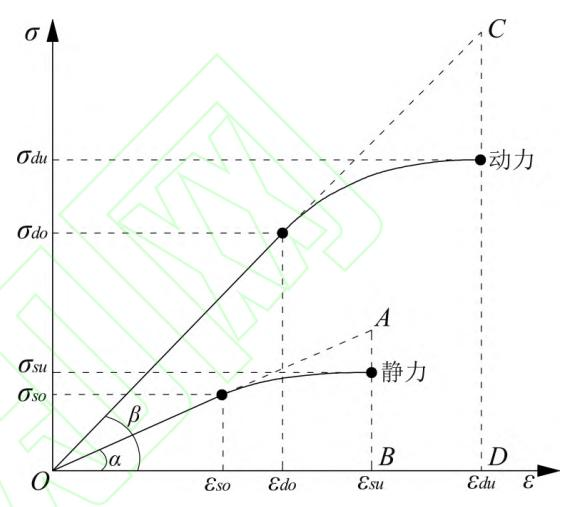

图1 动静力损伤本构曲线

Fig.1 Dynamic and static damage constitutive curve 由图中几何关系可得

$$\tan \alpha = \frac{\overline{AB}}{\overline{OB}} = \frac{\sigma_{so}}{\varepsilon_{so}} = E_s$$
 (15)

$$\tan \beta = \frac{\overline{CD}}{\overline{OD}} = \frac{\sigma_{do}}{\varepsilon_{do}} = E_d$$
 (16)

又根据损伤本构理论可知

$$\begin{cases} 1 - \lambda_s(\varepsilon_{su}) = \frac{\sigma_{su}}{\overline{AB}} \\ 1 - \lambda_d(\varepsilon_{du}) = \frac{\sigma_{du}}{\overline{CD}} \end{cases}$$
 (17)

将式(15)~式(16)代入式(17)可得

$$\frac{1 - \lambda_d(\varepsilon_{du})}{1 - \lambda_s(\varepsilon_{su})} = \frac{\omega_{\sigma}(\dot{\varepsilon})}{\omega_{E}(\dot{\varepsilon})\omega_{\varepsilon}(\dot{\varepsilon})}$$
(18)

其中,

$$\begin{cases} \omega_{\sigma}(\dot{\varepsilon}) = \frac{\sigma_{du}}{\sigma_{su}} \\ \omega_{\varepsilon}(\dot{\varepsilon}) = \frac{\varepsilon_{du}}{\varepsilon_{su}} \\ \omega_{E}(\dot{\varepsilon}) = \frac{E_{d}}{E_{s}} \end{cases}$$
(19)

实际上,式(18)对于静力曲线和动力曲线 均适用,但  $\omega_{\sigma}$  、 $\omega_{\varepsilon}$  会随应变率  $\dot{\varepsilon}$  和应变值  $\varepsilon$  变化, 因此有

$$\begin{cases}
\omega_{\sigma}(\dot{\varepsilon}, \varepsilon_{d}) = \frac{\sigma_{d}(\varepsilon_{d})}{\sigma_{s}(\varepsilon_{s})} \\
\omega_{\varepsilon}(\dot{\varepsilon}, \varepsilon_{d}) = \frac{\varepsilon_{d}}{\varepsilon_{s}}
\end{cases}$$
(20)

将式 (19) ~式 (20) 代入式 (18) 可得  $\frac{1 - \lambda_d(\varepsilon)}{1 - \lambda_s(\frac{\varepsilon}{\omega_c})} = \frac{\omega_\sigma(\dot{\varepsilon}, \varepsilon)}{\omega_E(\dot{\varepsilon})\omega_\varepsilon(\dot{\varepsilon}, \varepsilon)}$ (21)

而对于 $\omega_{\sigma}$ 、 $\omega_{\varepsilon}$ 的确定,引入以下假设

$$\omega_{\sigma}(\dot{\varepsilon},\varepsilon) = (\zeta + \eta \varepsilon)\omega_{\varepsilon}(\dot{\varepsilon}) \tag{22}$$

式(22)表明应力放大系数和应变放大系数 满足线性关系。当 $\varepsilon = \varepsilon_0$ 时, $\lambda_s = \lambda_d = 0$ ,因此由 式(21)和式(22)可得

$$\omega_{\sigma}(\dot{\varepsilon}, \varepsilon_0) = \omega_{E}(\dot{\varepsilon})\omega_{\varepsilon}(\dot{\varepsilon}) \tag{23}$$

另外当 $\varepsilon = \varepsilon_{du}$ 时,由式(19)和式(20)可得

$$\omega_{\sigma}(\dot{\varepsilon}, \varepsilon_{du}) = \omega_{\sigma}(\dot{\varepsilon}) \tag{24}$$

将式 (23) ~式 (24) 代入式 (22) 可得  $\begin{cases} \omega_{E}(\dot{\varepsilon})\omega_{\varepsilon}(\dot{\varepsilon}) = (\zeta + \eta\varepsilon_{0})\omega_{\varepsilon}(\dot{\varepsilon}) \\ \omega_{\sigma}(\dot{\varepsilon}) = (\zeta + \eta\varepsilon_{de})\omega_{\varepsilon}(\dot{\varepsilon}) \end{cases}$ (25)

解此方程组得

$$\begin{cases}
\zeta = \omega_{E}(\dot{\varepsilon}) - \left[\frac{\omega_{\sigma}(\dot{\varepsilon})}{\omega_{\varepsilon}(\dot{\varepsilon})} - \omega_{E}(\dot{\varepsilon})\right] \times \frac{\varepsilon_{du}}{\varepsilon_{du} - \varepsilon_{0}} \\
\eta = \frac{\omega_{\sigma}(\dot{\varepsilon})}{\omega_{\varepsilon}(\dot{\varepsilon})(\varepsilon_{du} - \varepsilon_{0})} - \frac{\omega_{E}(\dot{\varepsilon})}{\varepsilon_{du} - \varepsilon_{0}}
\end{cases} (26)$$

将式(22)、式(26)代入式(21)可以得到 动力损伤变量  $\lambda_t(\varepsilon)$  的表达式

$$\lambda_d(\varepsilon) = \lambda_s(\frac{\varepsilon}{\omega_{\varepsilon}(\dot{\varepsilon})}) + \eta(\varepsilon - \varepsilon_0)(\lambda_s(\frac{\varepsilon}{\omega_{\varepsilon}(\dot{\varepsilon})}) - 1) \quad (27)$$

将式(27)代入式(14)便可得到基于 Perzyna 弹黏塑性的动力损伤本构模型

$$\begin{cases} \sigma = E_d \varepsilon, & \varepsilon \leq \varepsilon_0 \\ \sigma = (F + f(\varepsilon^p))(1 + \eta(\varepsilon - \varepsilon_0))[1 - \lambda_s(\frac{\varepsilon}{\omega_{\varepsilon}(\dot{\varepsilon})})], & \varepsilon > \varepsilon_0 \end{cases}$$

$$(28)$$

为研究循环荷载作用下混凝土的力学性能, 现进一步修正该本构模型,考虑混凝土材料的疲劳性能退化,引入考虑长期荷载作用下混凝土疲劳强度和残余应变发展的修正本构模型[20],其中给出的受拉受压疲劳本构关系为

$$\sigma_{c} = k'_{c} E_{d}(N) (\varepsilon - \Delta \varepsilon_{r}(N-1))$$

$$\sigma_{t} = k'_{t} E_{d}(N) (\varepsilon - \Delta \varepsilon_{r}(N-1))$$
(29)

式中, $k'_c$ , $k'_i$ 分别为加载 N 次过后弹性模量、峰值应力应变及残余应变相关函数;  $\Delta \varepsilon_r (N-1)$  为疲劳荷载作用 N-1 次后的残余应变。

现将该模型代入式(28)中,得到考虑混凝 土循环荷载作用下的动力疲劳损伤本构模型为

$$\begin{cases}
\sigma = E_d(N)(\varepsilon - \Delta\varepsilon_r(N-1)), & \varepsilon \leq \varepsilon_0(N) \\
\sigma = k'(F + f(\varepsilon^p))(1 + \eta(N)) \cdot \\
[1 - \lambda_s(\frac{\varepsilon - \Delta\varepsilon_r(N-1)}{\omega_{\varepsilon}(\dot{\varepsilon})})] & , \varepsilon > \varepsilon_0(N)
\end{cases}$$
(30)

其中,

$$\eta(N) = \varepsilon - \Delta \varepsilon_r(N - 1) - \varepsilon_0(N) 
\varepsilon_0(N) = \Delta \varepsilon_r(N) + \frac{\sigma_r(N)}{\varepsilon_0(1)E_d(1)} (1 + \varepsilon_0(1))$$
(31)

式中,k'为加载 N次过后弹性模量、峰值应力应变及残余应变相关函数; $\varepsilon_0(N)$ 为结构加载 N次过后的动力损伤阈值应变; $\varepsilon_0(1)$ 、 $E_d(1)$ 分别为结构首次加载的动力损伤阈值应变和初始动弹性模量。

### 1.2 模型二次开发

本文通过 ABAQUS 提供的 UAMT 子程序完成了基于 Perzyna 弹黏塑性的动力疲劳损伤本构模型二次开发工作。子程序计算流程如图 2 所示,其中 ABAQUS 软件分析步设置采用接口参数 SKEP 判定,当 SKEP>1,则采用非弹性即黏塑性分析。

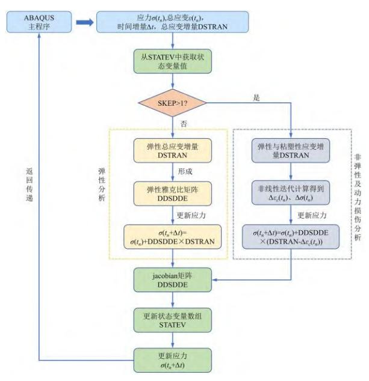

图2 UMAT 子程序开发框图

Fig.2 UMAT subroutine development block diagram

## 1.3 模型应用及验证

为验证所开发模型的正确性及有效性,采用 该程序对混凝土试块循环加载试验进行数值仿真 分析。引用李庆东[21]关于循环冲击荷载下的混凝 土 力 学 特 性 试 验 研 究 结 果 , 混 凝 土 试 块 (50mm×50mm)为圆柱体试样,如图 3(a)所示, 研究循环冲击荷载下不同轴压对混凝土力学性能 的影响。以试验为原型建立混凝土三维数值模型 如图 3(b)所示,圆柱体混凝土模型高 50mm, 直径为 50mm。混凝土初始动弹模为 9.2GPa,抗 压强度为 28.9MPa。模型底部固定,上部中心施加 轴力,轴力值设置为 9MPa。每种轴压设置三种循 环冲击加载速度,分别为 6,7,8m/s,循环加载 次数设置为 10 次。

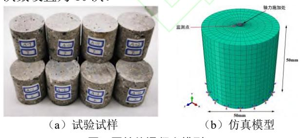

图3 圆柱体混凝土模型

Fig.3 Cylindrical concrete model

比较不同循环冲击荷载速度下混凝土试样的 动态应力应变曲线如 0 所示。在循环轴压 9MPa, 荷载冲击速度 6m/s 时,该试样最终的加载破坏损 伤形态如图 5 所示。

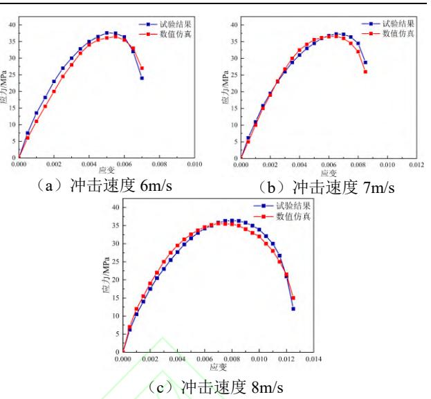

图4 圆柱体混凝土试样动态应力应变曲线

Fig.4 Dynamic stress-strain curve of cylinder concrete

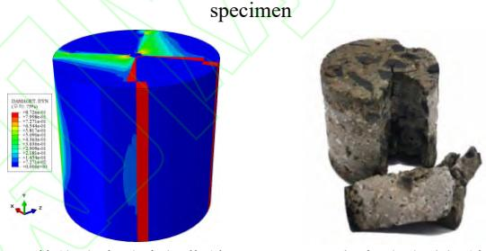

(a)数值仿真动力损伤结果 (b)室内试验破坏结果

图5 圆柱体混凝土试样加载破坏结果

Fig.5 Loading failure results of cylinder concrete specimen

从 0 及图 5 可以看出,不同冲击荷载速度作 用下数值模拟结果与室内试验结果基本一致,受 拉破坏开裂结果(红色部分)也与室内试验结果 基本一致。综上可知,基于 Perzyna 弹黏塑性的动 力疲劳损伤本构模型能够有效模拟混凝土材料在 动力作用下的疲劳损伤,具有较好的准确性。

## 2 模型建立及参数取值

## 2.1 工程概况

本文以沈白高铁前林子隧道为工程依托,该 隧道位于辽宁省抚顺市抚顺县上马乡,是沈白高 铁的重要组成部分。隧道总长超过 1600m,最大 埋深超过 130m,该隧道区域地质构造复杂,岩层 条件多变,工程环境恶劣,在沈阳至长白山(二 道白河)段高铁修建过程中作为控制性工程,具 有一定的代表性。

同时该隧道部分岩体遭受环境风化作用,表 现出显著的膨胀特性,不仅给隧道掘进带来巨大 困难,也为后续服役安全埋下潜在风险。本文以 全风化玄武岩为焦点,研究隧道底部结构动力响 应与全服役周期损伤演化规律。

#### 2.2 模型建立

以前林子隧道横截面为基础建立隧道模型,基于有限元理论,根据现场实际情况采用ABAQUS数值软件建立列车动载-围岩-结构三维动力计算模型。为了提高模型计算效率和准确性,依据圣维南原理设置模型长(X方向)、宽(Y方向)、高(Z方向)尺寸为80m×70m×100m,其中Z轴方向为隧道纵向。隧道洞周附近设置为膨胀围岩,其余部分设置为普通围岩,通过计算得到的扣件荷载时程曲线对左右轨道板施加扣件荷载,并采用ABAQUS隐式动力分析进行求解。本文采用土体整体模型划分,其计算模型如图6所示。

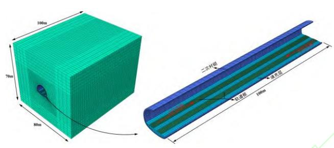

图6 列车动载-围岩-结构三维动力计算模型

Fig.6 Three-dimensional dynamic calculation model of train dynamic load-surrounding rock-structure

#### 2.3 参数取值

### (1) 材料参数

本次计算围岩参数根据依托工程选取,确定为IV级围岩,采用摩尔库伦理想弹塑性本构,具体参数如表 1 所示。

### 表1 围岩参数取值

Tab.1 Value of surrounding rock parameters

| 类型   | E/GPa | y/ (kN/m 3 ) | ν   | φ/ (°) | C/kPa |
|------|-------|----------------------------|-----|--------|-------|
| 普通围岩 | 3.6   | 22.0                       | 0.3 | 30     | 500   |

隧道支护结构参数根据实际工程进行设置,在模拟过程中,对隧道衬砌结构引入二次开发的基于 Perzyna 弹黏塑性的动力疲劳损伤本构模型,其余采用线弹性模型。隧道及支护结构具体参数如表 2 所示。

#### 表2 隧道及支护结构参数

Tab.2 Parameters of tunnel and supporting structure

|     |           |       |                            | 11  | U                    |                      |  |
|-----|-----------|-------|----------------------------|-----|----------------------|----------------------|--|
| 类型  | 混凝土 等级 | E/GPa | $\frac{\gamma}{/(kN/m^3)}$ | ν   | f ck /MPa | f tk /MPa |  |
| 初支  | C25       | 28.0  | 23.8                       | 0.2 | 16.7                 | 1.78                 |  |
| 填充层 | C20       | 25.5  | 23.7                       | 0.2 | 13.4                 | 1.54                 |  |
| 二衬  | C35       | 31.5  | 23.9                       | 0.2 | 23.4                 | 2.20                 |  |
| 轨道板 | C40       | 32.5  | 24.0                       | 0.2 | 26.8                 | 2.39                 |  |

#### (2) 人工边界及阻尼系数

黏弹性人工边界计算公式参考相关研究[22-23],得到其等效弹簧及阻尼器参数,动力边界具体参数如表 3 所示。

表3 动力边界参数 Tab.3 Dynamic boundary parameters

| 边界参数 | $K_{\mathrm{BT}}$ | $K_{\rm BN}$ | $C_{\mathrm{BT}}$ | $C_{\rm BN}$ |  |
|------|-------------------|--------------|-------------------|--------------|--|
| 粉估   | 13/12/65/11       | 24732530     | 1442521           | 2852812      |  |

注: $K_{BT}$  为弹簧切向刚度; $K_{BN}$  为弹簧法向刚度; $C_{BT}$  为阻尼切向系数; $C_{RN}$  为阻尼法向系数。

计算采用 Rayleigh 阻尼,根据 ABAQUS 结构 振型计算结果,选取  $w_1$ =2.783、 $w_2$ =4.816 为计算 频率,再根据既有研究取土体的阻尼比  $\xi_i$ = $\xi_j$ =0.05,计算得到阻尼系数  $\alpha$ =0.1821, $\beta$ =0.0173。除此之 外,在地层模型四周施加现场实测的初始地应力。

#### (3) 列车振动荷载

根据已有研究[24-25],将扣件荷载分担的距离 关系转化为过车时间,得到高铁列车荷载作用下 的扣件荷载时程曲线公式为

$$f(v,t) = \sum_{i=1}^{n} \sum_{j=1}^{4} P_0 \gamma(vt - x_0)$$
 (32)

式中,v为过车速度;t为运行时间; $P_0$ 为轮轨接触力;x为车轮相对位置; $\gamma$ 为等效列车荷载分布函数。

参考主要运营列车 CRH3 的参数标准,取列车速度为 350km/h,8 节车厢荷载作用,轴重取170kN,扣件刚度取 20kN/mm,扣件间距取650mm,计算得到 350km/h 速度下的扣件荷载时程曲线,如图 7 所示。

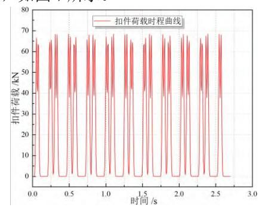

图7 扣件荷载时程曲线

Fig.7 Fastener load time history curve

## (4) 围岩膨胀效应模拟

考虑膨胀围岩湿度变化的渗流场问题类似于 温度场的热传导问题,可通过等效换算利用温度 场变化引起围岩体积膨胀效应来模拟膨胀围岩的 吸水膨胀特性[26],以此分析膨胀荷载作用。通过 设置温度场参数,使得围岩因吸水膨胀和升温膨胀产生等效的应变增量,得到膨胀系数计算公式为

$$\alpha = \frac{\beta \Delta w}{\Delta T} = \frac{\beta C_w \Delta u}{\Delta T}$$
 (33)

式中, $\alpha$  为温度膨胀系数;  $\beta$  为湿度膨胀系数;  $\Delta w$  为单位体积围岩含水率变化量;  $C_w$  为比水容量;  $\Delta u$  为基质吸力变化量。

进而可得膨胀力、温度及膨胀系数间关系为

$$\Delta P_a = 3K\Delta T\alpha \tag{34}$$

式中, $\Delta P_a$  为膨胀力增量;K 为围岩体积模量。本文参考依托工程实况,取  $C_w$  为  $0.085 \,\mathrm{m}^{-1}$ ,设置围岩初始含水率  $w_0$  为 2.4%,对应的温度  $T_0$  为 0,最终含水率对应的温度  $T_1$  为  $1.793 \,^{\circ}$ C,膨胀力为  $100 \,\mathrm{kPa}$ 。根据式(34)可以得到温度膨胀系数  $\alpha$  为  $2.13 \times 10^{-4} \,^{\circ}$ C。

### 2.4 测点布设

为探究隧道分别运营 0.5, 10, 30, 50, 70, 100 年后高铁隧道底部结构的动力响应及损伤发展, 考虑最不利情况, 过车方式设置为双向过车, 出于结构对称性的考虑, 观测断面及对应测点设置 如图 8 所示。

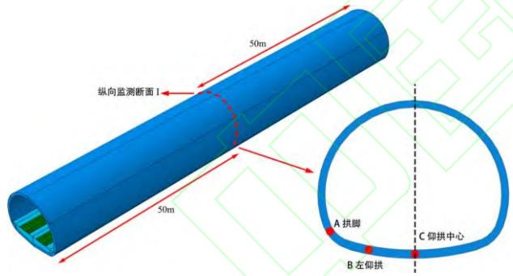

图8 隧道底部结构观测点设置示意

Fig.8 Schematic diagram of observation point setting of tunnel bottom structure

## 3 不同围岩条件下运营期隧道底部结构动力 响应分析

为探究运营期隧道底部结构动力响应规律, 对不同围岩条件下隧底结构在不同服役期限的加 速度、最小主应力、结构内力及安全系数进行动 力响应分析。

#### 3.1 加速度分析

绘制不同运营年限下隧底结构各测点加速度 极值变化曲线如图 9 所示。

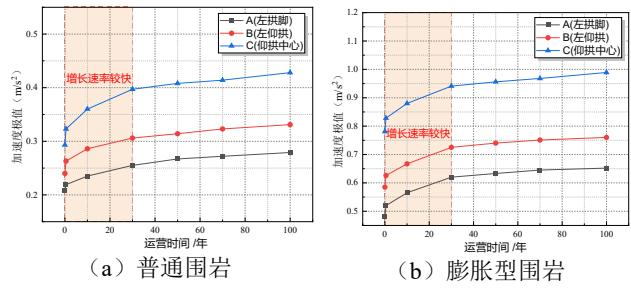

图9 不同运营年限隧底结构观测点加速度极值变化曲线 Fig.9 The change curve of acceleration extreme value of observation point of tunnel bottom structure with different operating years

从图 9 可以看出,隧道底部结构加速度极值 随运营年限呈两阶段增长,前 30 年快速上升,后 期相对较缓。空间分布上,仰拱中心响应最强烈, 表明仰拱中心处受到的列车震动影响最为严重。 在膨胀荷载作用下,所激发的竖向振动水平也显 著提高,进而导致加速度响应明显增强。隧道运 营 100 年后,左拱脚、左仰拱、仰拱中心的加速 度极值相比无膨胀时增幅分别达 129.6%,133.7%、 131.1%,表明膨胀荷载对隧道加速度响应影响较 大,在长期运营分析中不可忽视。

## 3.2 最小主应力分析

绘制不同运营年限下隧底结构各测点最小主 应力极值变化曲线如图 10 所示。

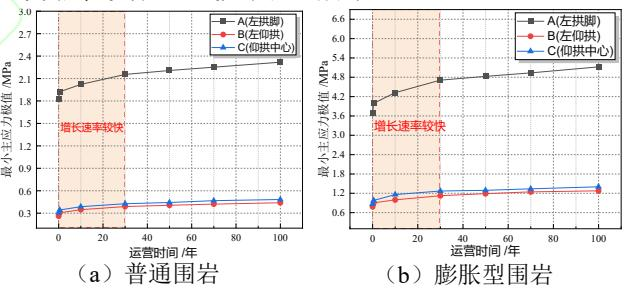

图10 不同运营年限隧底结构观测点最小主应力极值变化 曲线

Fig.10 The variation curve of the minimum principal stress extreme value of the observation point of the tunnel bottom structure with different operating years

对比不同观测点处的最小主应力极值大小, 拱脚处明显大于其他部位,此时衬砌结构主要承 受来自围岩的压力,造成隧道断面拱脚处最小主 应力极值最大。膨胀荷载变化不会改变衬砌结构 主应力总体分布规律,但显著影响各部位主应力 峰值变化。在隧道运营 100 年后,左拱脚、左仰 拱、仰拱中心的最小主应力极值相较于未膨胀时 增幅分别为 121.0%,190.6%,190.7%。

#### 3.3 轴力、弯矩分析

绘制不同运营年限下普通及膨胀围岩隧道底

部结构各测点轴力、弯矩极值变化曲线分别如图 11、图 12 所示。

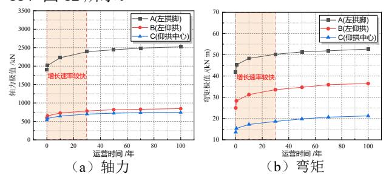

图11 普通围岩不同运营年限隧底结构观测点轴力、弯矩 极值变化曲线

Fig.11 The variation curves of axial force and bending moment of tunnel bottom structure observation points with different operating years of ordinary surrounding rock

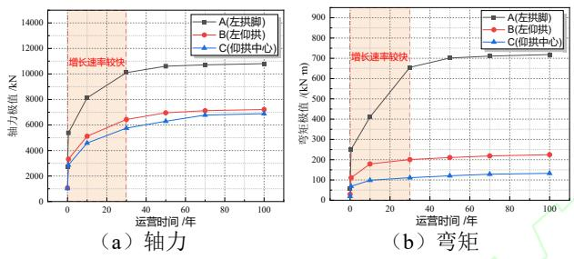

图12 膨胀围岩不同运营年限隧底结构观测点轴力、弯矩 极值变化曲线

Fig.12 Variation curves of axial force and bending moment of observation points of tunnel bottom structure with different operating years of expansive surrounding rock

由图 11、图 12 可知,在隧道运营前 30 年内轴力、弯矩极值增长速度较快,后期增长速度放缓。在隧道运营 100 年后左拱脚、左仰拱、仰拱中心处轴力极值相较于首次运行分别增大 2.9 倍、5.8 倍、5.7 倍;弯矩极值相较于首次运行分别增大 12 倍、6.6 倍、6.1 倍。相比无膨胀时,在隧道运营 100 年后左拱脚、左仰拱、仰拱中心处轴力和弯矩极值均增大 3 倍以上,其内力增幅十分显著。

## 3.4 安全系数分析

为进一步研究轴力和弯矩对结构安全性能的 影响,计算不同运营年限隧道底部结构不同部位 的安全系数,其变化曲线如图 13 所示。

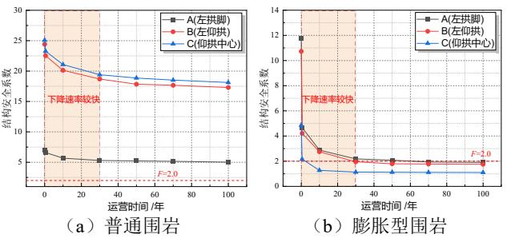

#### 图13 不同运营年限隧底结构观测点安全系数变化曲线

Fig.13 Change curve of safety factor of observation point of tunnel bottom structure with different operating years

由图 13 可知,普通围岩隧道运营 100 年后, 左拱脚、左仰拱、仰拱中心的安全系数分别下降 至 5.01、17.3、18.13,虽然结构安全系数有所下 降,但总体而言,隧道结构依然处于安全范围内。 而膨胀岩隧道运营 100 年后左拱脚、左仰拱、仰 拱中心的安全系数分别下降至 1.90、1.75、1.10, 各测点安全系数小于规范中要求的控制标准 (F=2),此时结构的安全性已难以得到有效保障。

## 4 不同围岩条件下运营期隧道底部结构损伤 发展分析

为探究运营期隧道底部结构损伤发展规律, 对不同围岩条件下隧道底部在不同服役期限的结 构损伤进行分析。

## 4.1 动力受压损伤分析

#### (1) 普通围岩

不同运营年限下普通围岩隧道底部结构在高速列车动载作用下的动力受压损伤如图 14 所示。

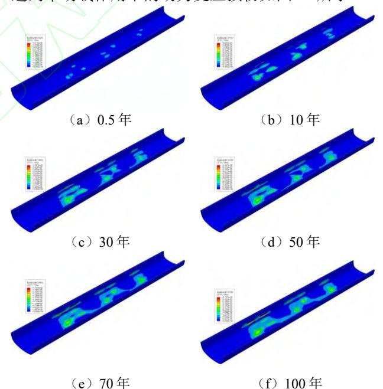

图14 普通围岩隧道底部结构动力受压损伤演化云图 Fig.14 Dynamic compression damage evolution cloud diagram of the bottom structure of ordinary surrounding rock tunnel

从图 14 可以看出,动力受压损伤演化数值和范围都随运营年限增长而增加,其演化规律可概括为三个发展阶段:阶段一损伤初步产生,且随机性强,主要集中在仰拱附近;阶段二底部损伤在一定范围内向四周快速扩散,损伤面积增大,呈现小范围集中;阶段三区域损伤沿隧道纵向和

环向缓慢延伸,逐渐贯通形成整体破坏。

为进一步研究动力损伤随运营年限增加的变 化趋势,提取不同运营年限动力受压损伤极值绘 制变化趋势,如图 15 所示。

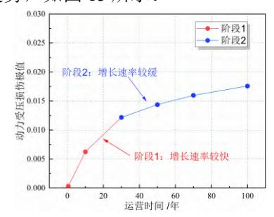

图15 普通围岩隧道底部结构动力受压损伤极值变化曲线 Fig.15 Change curve of dynamic compression damage extreme value of bottom structure of ordinary surrounding rock tunnel

由图 15 可以看出,不同运营年限动力受压损 伤极值整体上变化趋势可以划分为两个阶段:阶 段一,在隧道运营 0~30 年,结构受压损伤发展较 为迅速;阶段二,在隧道运营 30~100 年,结构受 压损伤发展较缓,增长速度明显小于第一阶段。

## (2)膨胀围岩

不同运营年限下膨胀围岩隧道底部结构在高 速列车动载作用下的动力受压损伤如图 16 所示。

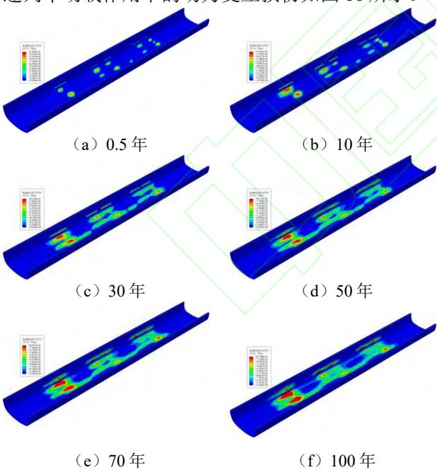

图16 膨胀作用下隧道底部结构受压损伤演化云图 Fig.16 Compression damage evolution cloud diagram of tunnel bottom structure under expansion effect

由图 16 可知,动力受压损伤演化规律和普通 岩条件下基本一致,但与无膨胀时相比,隧道运 营初期 0.5 年时拱脚部位便开始出现受压损伤,损 伤极值为 0.329。除此之外,膨胀作用下不同运营 年限隧道衬砌结构受压损伤范围和损伤数值均明 显偏大,且随着运营年限的增加,受压损伤区域 扩散速率更快。

为进一步研究膨胀作用下动力损伤随运营年 限增加的变化趋势,提取不同运营年限动力受压 损伤极值绘制变化趋势,如图 17 所示。

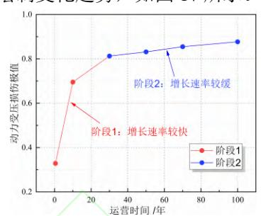

图17 膨胀岩隧道底部结构动力受压损伤极值变化曲线 Fig.17 Change curve of dynamic compression damage extreme value of bottom structure of expansive rock tunnel

由图 17 可以看出,膨胀作用下不同运营年限 动力受压损伤极值整体上变化趋势与无膨胀时情 况一致,更明显划分为两个阶段。在膨胀作用下, 阶段一的损伤极值增长速率明显加快,而隧道运 营 100 年后,动力受压损伤极值达到 0.877,约为 无膨胀时的 50 倍,严重影响隧道结构的长期安全 服役性能。

## 4.2 动力受拉损伤分析

#### (1)普通围岩

不同运营年限下普通围岩隧道底部结构在高 速列车动载作用下的动力受拉损伤如图 18 所示。

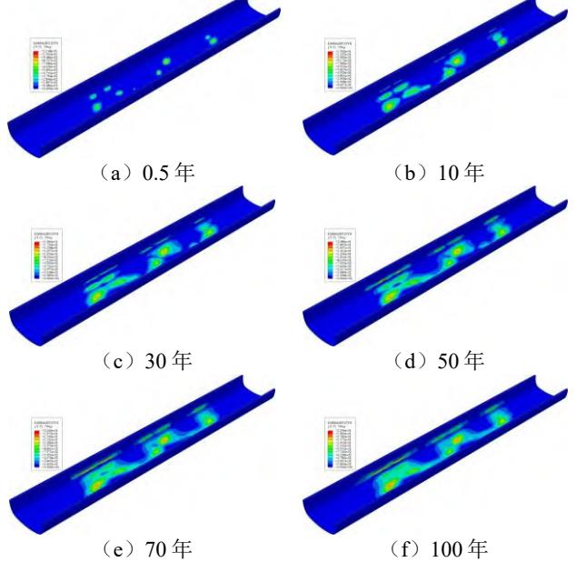

图18 普通围岩隧道底部结构动力受拉损伤演化云图 Fig.18 Evolution cloud diagram of dynamic tensile damage of bottom structure of ordinary surrounding rock tunnel 由图 18 可知,动力受拉损伤演化数值和范围

都随运营年限的增长有所增加。与受压损伤类似, 在隧道运营初期,损伤主要集中在仰拱附近,呈 局部分散状,隧道运营 10 年后损伤由仰拱向拱脚 部位扩散,逐渐连通形成整体损伤。

为进一步研究动力损伤随运营年限增加的变 化趋势,提取不同运营年限动力受拉损伤极值绘 制变化趋势,如图 19 所示。

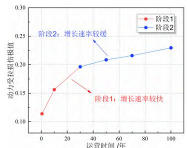

图19 普通围岩隧道底部结构动力受拉损伤极值变化曲线 Fig.19 The variation curve of the extreme value of dynamic tensile damage of the bottom structure of ordinary surrounding rock tunnel

由图 19 可知,动力受拉损伤极值随运营年限 也呈两阶段变化:0~30 年发展迅速,30~100 年 增速放缓。与动力受压损伤相比,受拉损伤数值 和范围更大,隧道运营 100 年后,动力受拉损伤 和受压损伤极值分别为 0.230、0.018,约为受压损 伤极值的 12 倍,可见混凝土衬砌结构对于受拉破 坏的敏感性,在隧道运营后期,极有可能出现一 定数量的裂缝。

## (2)膨胀围岩

不同运营年限下膨胀围岩隧道底部结构在高 速列车动载作用下的动力受拉损伤如图 20 所示。

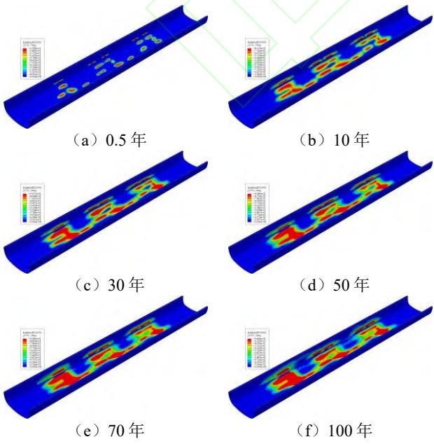

图 20 膨胀作用下隧道底部结构受拉损伤演

## 化云图

Fig.20 The tensile damage evolution cloud diagram of tunnel bottom structure under expansion action

由图 20 可知,动力受拉损伤演化规律与普通 围岩条件下基本一致,但膨胀岩隧道运营 0.5 年时 拱脚部位便出现受拉损伤,损伤极值为 0.458,约 为无膨胀时损伤极值的 4 倍。膨胀作用下不同运 营年限隧道结构受拉损伤范围和数值会更大,且 扩散速率更快。围岩膨胀作用会增大隧道结构内 力,导致拱脚、仰拱部位受损较为严重。

为进一步研究动力受拉损伤随运营年限增加 的变化趋势,提取不同运营年限动力受拉损伤极 值绘制变化趋势,如图 21 所示。

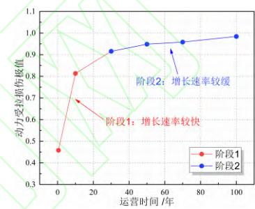

图 21 膨胀岩隧道底部结构动力受拉损伤极值变化曲线 Fig.21 Change curve of dynamic tensile damage extreme value of bottom structure of expansive rock tunnel

由图 21 可知,膨胀作用下不同运营年限动力 受拉损伤极值整体上变化趋势与无膨胀时基本一 致。膨胀作用加速了动力受拉损伤极值的增长, 隧道运营 100 年后,动力受拉损伤极值达到 0.984, 约为无膨胀时的 4.3 倍,此时隧道结构破坏程度较 大,局部出现开裂。运营初期(0.5 年)及后期 (100 年),受拉损伤极值约为受压损伤极值的 1.4 及 1.1 倍,受拉损伤数值及范围均大于受压损伤。

## 5 结论

本文基于 Perzyna 弹黏塑性理论推导了考虑动 载作用下混凝土动力疲劳损伤本构模型,通过隧 道结构三维数值模拟,研究膨胀岩高铁隧道底部 结构动力响应,明确隧道全服役周期底部结构损 伤发展规律,主要结论如下。

- (1)对基于 Perzyna 弹黏塑性的动力疲劳损 伤本构模型进行二次开发,编制相应的 UMAT 子 程序,通过不同冲击荷载速度作用下仿真结果与 室内试验结果对比,验证了该程序具有较好的准 确性。
- (2)隧道底部结构的加速度、最小主应力、 结构内力极值均随隧道运营年限增加呈现出时变

规律,前 30 年各项极值增长迅速,而 30~70 年几 乎呈线性缓慢增长,可用于预测未来结构响应的 增长趋势。

- (3)膨胀作用下隧底结构的动力响应显著增 强,相比无膨胀工况下隧道运营后期(100 年)加 速度与最小主应力响应极值增幅达到 100%以上, 而结构内力增幅更是超过 200%。同时安全系数降 幅最大可达 89.8%,最小值仅为 1.1,低于规范要 求的控制标准(*F*=2)。此时结构的安全性已难以 得到保障,极有可能产生混凝土开裂灾害危及隧 道的正常工作。
- (4)高铁隧道底部结构的动力损伤演化规律 可概括为三个发展阶段:阶段一损伤初步产生, 且随机性强,高度分散;阶段二底部损伤在一定 范围内向四周快速扩散,损伤面积增大,呈现小 范围集中;阶段三区域损伤沿隧道纵向和环向缓 慢延伸,逐渐贯通形成整体破坏。
- (5)膨胀作用会加快隧道结构动力损伤极值 增长,损伤区域扩散速率也更快,且受拉损伤极 值与范围均大于受压损伤。隧道运营 100 年后, 受拉、受压损伤极值分别达到 0.984、0.877,相对 无膨胀时增幅皆在 300%以上,需在设计修建初期 进行针对性防范或在运营期定期开展结构安全检 测。

## 参考文献:

- [1] 田四明,王伟,巩江峰.中国铁路隧道发展与展望(含截至 2020 年底中国铁路隧道统计数据)[J].隧道建设(中英 文),2021,41(2):308-325.
  - TIAN Siming, WANG Wei, GONG Jiangfeng. Development and Prospect of Railway Tunnels in China(Including Statistics of Railway Tunnels in China by the End of 2020)[J]. Tunnel Construction, 2021, 41(2): 308-325.
- [2] 宋国华,陈东生,齐法琳.高铁隧道裂缝成因分析[J].中国 铁路,2018(6):19-21,27.
  - SONG Guohua, CHEN Dongsheng, QI Falin. The Cause Analysis of High Speed Railway Tunnel Crack[J]. China Railway, 2018(6): 19-21, 27.
- [3] 于航,冯应,朱星宇,等.高铁列车动载作用下膨胀土隧道 动力响应及服役性能[J/OL].铁道标准设计,1-12[2025- 07-01].https://doi.org/10.13238/j.issn.1004- 2954.202408010003.
  - YU Hang, FENG Ying, ZHU Xingyu, et al. Dynamic Response and Service Performance of Expansive Soil Tunnel under Dynamic Load of High-speed Train[J/OL]. Railway Standard Design. 1-12[2025-07-01].

- https://doi.org/10.13238/j.issn.1004-2954.202408010003.
- [4] 彭立乾.隧道施工和列车荷载影响下箱涵开挖面稳定性 分析[J].地下空间与工程学报,2024,20(S2):989-998. PENG Liqian. Stability Analysis of Excavation Face of Box Culvert under the Influences of Tunnel Construction and Train Load[J]. Chinese Journal of Underground Space and Engineering, 2024,20(S2):989-998.
- [5] 罗钧瀚,任文涛,张凯,等.地震-行车荷载耦合作用下隧道 动力响应数值仿真研究[J/OL].铁道标准设计,1- 12[2025-06-23].https://doi.org/10.13238/j.issn.1004- 2954.202312140006.
  - LUO Junhan, REN Wentao. ZHANG Kai, et al. Numerical Study on the Dynamic Response of Tunnels Under the Coupling Effect of Seismic and Train Moving Loads[J/OL]. Railway Standard Design. 1-12[2025-06- 23].https://doi.org/10.13238/j.issn.1004- 2954.202312140006.
- [6] 陈晨, 曹瑞琅, 赵宇飞, 等. 列车荷载作用下高铁隧道下 有小净距地铁隧道穿越时的结构动力响应特性模拟分 析[J]. 城市轨道交通研究, 2020, 23(1): 31-36.
  - CHEN Chen, CAO Ruilang, ZHAO Yufei, et al. Simulation Analysis on High-speed Railway Structural Dynamic Response under the Action of Train Load when Metro Tunnel in Minimal Spacing under High-speed Railway[J]. Urban Mass Transit, 2020, 23(1): 31-36.
- [7] WANG D K, LUO J J, LI F L, et al. Research on Dynamic Response and Fatigue Life of Tunnel Bottom Structure under Coupled Action of Train Load and Groundwater[J]. Soil Dynamics and Earthquake Engineering, 2022, 161: 107405.
- [8] ZHOU Y, YANG W B, YAO C F, et al. Centrifuge Modelling of the Dynamic Response of Twin Tunnels under Train-induced Vibration Load[J]. Soil Dynamics and Earthquake Engineering, 2024, 185: 108908.
- [9] LEI H, LYU Z, QIAN J G. Dynamic Response of a Multilayered Saturated Ground with a Tunnel Subjected to Braking Moving Loads[J]. Transportation Geotechnics, 2025, 52: 101587.
- [10] GUO W Q, YANG W B, QIAN Z H, et al. The Effect of Internal Structure on Dynamic Response of Road-metro Tunnels under Train Vibration Loads: an Experimental Study[J]. Tunnelling and Underground Space Technology, 2023, 138: 105182.
- [11] 刘凯,吴再新,杨吉忠,等.飞机降落冲击荷载作用下高铁 隧 道 动 力 响 应 及 疲 劳 损 伤 研 究[J].现代隧道技 术,2022,59(2):96-102.
  - LIU Kai, WU Zaixin, YANG Jizhong, et al. Study of Dynamic Response and Fatigue Damage of High-speed Railway Tunnels under the Impact Load of Aircraft Landing[J].Modern Tunnelling Technology,

2022,59(2):96-102.

52(3): 538-546.

- [12] 饶晨捷,王景春,王大鹏,等.重载铁路隧道衬砌结构车致 累积损伤演化规律[J].振动与冲击,2024,43(20):282-288. RAO Chenjie, WANG Jingchun, WANG Dapeng, et al. Evolution Law of Vehicle-induced Cumulative Damage of a Heavy Duty Railway Tunnel Lining Structure[J]. Journal of Vibration and Shock, 2024, 43(20): 282-288.
- 特性的影响[J].东南大学学报(自然科学版),2022,52(3):5 38-546. ZHAO Tao, LIANG Qingguo, WU Feiya, et al. Impact of Base Surrounding Rock Expansion on the Mechanical Characteristics of Mudstone Tunnel[J]. Journal of Southeast University (Natural Science Edition), 2022,

[13] 赵涛,梁庆国,吴飞亚,等.基底围岩膨胀对泥岩隧道受力

- [14] LIU N, PENG L M, SHI C H, et al. Experimental and Model Study on Dynamic Behaviour and Fatigue Damage of Tunnel Invert[J].Construction and Building Materials,2016,126:777-784.
- [15] YAN Q X, SUN M H, QING S Y, et al. Numerical Investigation on the Damage and Cracking Characteristics of the Shield Tunnel Caused by Derailed High-speed Train[J]. Engineering Failure Analysis, 2020, 108: 104205.
- [16] LI F L, JIANG C S, CAI G Q, et al. Pressure Waves and Their Influence on Fatigue Damage of Shield Tunnel Segment Structure[J]. Journal of Wind Engineering and Industrial Aerodynamics, 2023, 242: 105573.
- [17] CHEN K, CUDMANI R. One Fatigue Damage Constitutive Model for Rocks Considering Previously Accumulated Degradation and Its Engineering Application on the Fatigue Life Prediction[J]. Engineering Geology, 2025, 353: 108123.
- [18] ZHANG K J, ZHANG Z Q, LAN Q N. Dynamic Responses and Long-term Damage Evolution of Tunnels in Expansive Strata under Dynamic Loads from Highspeed Trains[J]. Transportation Geotechnics, 2024, 49: 101391.
- [19] 黄奕程, 王志良, 申林方, 等. 应变率效应影响下混凝土 材料冲击损伤过程的近场动力学分析[J]. 材料导报, 2025, 39(S1): 320-327.
  - HUANG Yicheng, WANG Zhiliang, SHEN Linfang, et al. Peridynamic Analysis of the Impact Damage Process of Concrete Materials under Strain Rate Effects[J]. Materials Reports, 2025, 39(S1): 320-327.
- [20] 黄希.交叉盾构隧道列车振动响应及其累积损伤研究 [D].成都:西南交通大学,2017.
  - HUANG Xi. Study on Train Vibration Response and Cumulative Damage of Cross Shield Tunnel[D]. Chengdu: Southwest Jiaotong University, 2017.

- [21] 李庆东.循环冲击荷载下机制砂喷射混凝土力学特性试 验研究[D].焦作:河南理工大学,2022.
  - LI Qingdong. Experimental study on mechanical properties ofmanufactured sand shotcrete under cyclic impact load[D]. Jiaozuo: Henan Polytechnic University,2022.
- [22] 刘晶波,谷音,杜义欣.一致粘弹性人工边界及粘弹性边 界单元[J].岩土工程学报,2006(9):1070-1075. LIU Jingbo, GU Yin, DU Yixin. Consistent Viscous-spring
  - Artificial Boundaries and Viscous-spring Boundary Elements[J]Chinese Journal of Geotechnical Engineering,2006(9):1070-1075.
- [23] 马笙杰,迟明杰,陈红娟,等.黏弹性人工边界在 ABAQUS 中的实现及地震动输入方法的比较研究[J].岩石力学与 工程学报,2020,39(7):1445-1457.
  - MA Shengjie, CHI Mingjie, CHEN Hongjuan, et al. Implementation of Viscous-spring Boundary in ABAQUS and Comparative Study on Seismic Motion Input Methods[J].Chinese Journal of Rock Mechanics and Engineering,2020,39(7):1445-1457.
- [24] 王祥秋,杨林德,高文华.铁路隧道提速列车振动测试与 荷载模拟[J].振动与冲击,2005, 24 (3):99-102. WANG Xiangqiu, YANG Linde, GAO Wenhua. In situ Vibration Measurement and Load Simulation of the Raising Speed Train in Railway Tunnel[J]. Journal of Vibration and Shock, 2005, 24(3): 99-102.
- [25] 王启云,张家生,孟飞,等.高速铁路路基模型列车振动荷 载模拟[J].振动与冲击,2013,32(6):43-46,72. WANG Qiyun, ZHANG Jiasheng, MENG Fei, et al. Simulation of Train Vibration Load on the Subgrade Testing Model of High-speed Railway[J]. Journal of Vibration and Shock, 2013, 32(6): 43-46, 72.
- [26] 申权,杨果林,房以河,等.一种膨胀土湿度应力场的近似 计算方法[J].深圳大学学报(理工版),2016,33(1):41-48. SHEN Quan, YANG Guolin, FANG Yihe, et al. An Approximation for Calculating Moisture Stress Field of Expansive Soil[J]. Journal of Shenzhen University Science and Engineering, 2016, 33(1): 41-48.